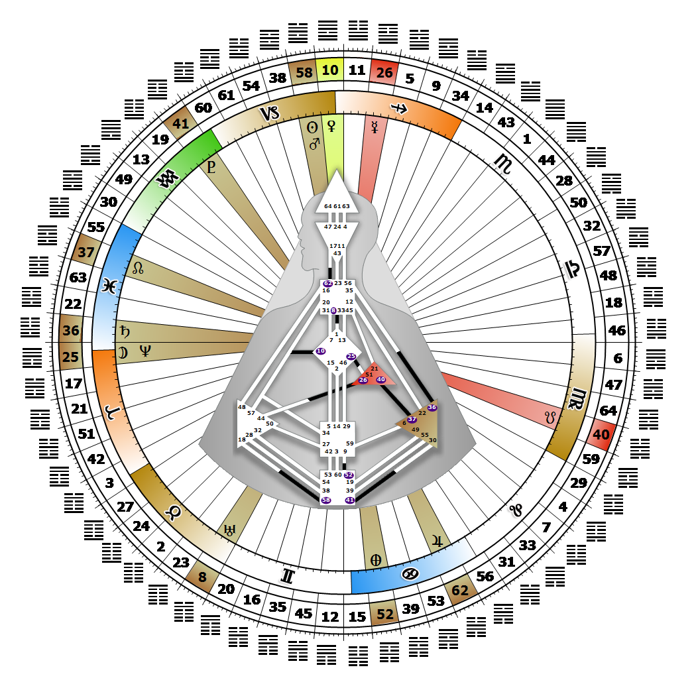

# Gate 58 - The Joyous

**December 27, 2025**

## *Gate of Vitality - The Vitality to Challenge*

> Stimulation is the key to joy. The zest for life and the energy for a 'better-life'. Criticism is a natural by-product of this improvement energy.

### Right Angle Cross of Service 4 | Godhead - Vishnu

*Quarter of Mutation,  the Realm of SiriusTheme: Purpose fulfilled through TransformationMystical Theme: Accepting Death*

---

This Gate is part of the Channel of Judgment, A Design of Insatiability, linking the Root Center (Gate 58) with the Splenic Center (Gate 18). Gate 58 is part of the Collective Understanding (Logic) Circuit with the keynote of sharing.

Gate 58 has the ability to sense when something is weak or unhealthy. We bring to living a joyful and compassionate audacity to challenge a pattern or the authority behind it. The pleasure we derive from sharing our appreciation of beauty, our sense of wonder and our zest for living, naturally attracts and delights others. To satisfy a driving desire to contribute something of value, we focus our vitality and joy for life on correcting anything that keeps society from achieving and maintaining well-being and health. Gate 58 provides the fuel logic needs to test the viability of patterns, formulas, rhythms and directions that are moving humanity into the future. It is logic's most precious and highly coveted energy resource. We often provide the energy that is needed to move people from talking about something to doing something about it. To channel our energy correctly, to conservatively and appropriately apply it where it is most needed, we look to people with Gate 18. Their existential awareness helps us focus our energy on determining which improvements should be made and how to manifest them. Without Gate 18 we can feel desperate to be of service in some way, and push too hard to figure it out ourselves.

---

### Line 3 - Electricity

**☀️ Exaltation:** The individual whose electric vitality creates its own stimulation and is not dependent on others. The energy to fuel independent stimulation.

**🌑 Detriment:** The quality of fire is dependent on its fuel and subject to its influence, good or bad. The energy for aliveness that is dependent on others for stimulation.
