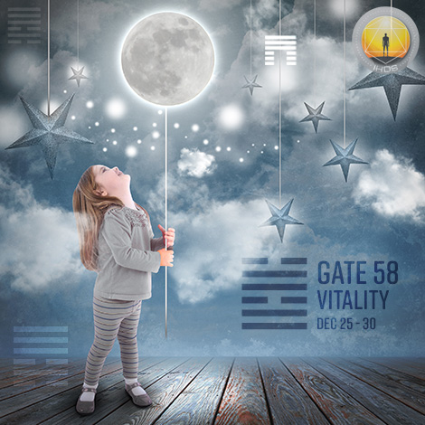

# 閘門 58 - 喜悅之門

**2025年12月27日**

## *活力之門 - 挑戰的活力*

> 刺激是喜悅的關鍵。這是對生命的熱情，以及追求「更美好生活」的能量。批評則是這股進步能量自然產生的副產品。

### 右角度服務之十字 4 | 神性 - 毗濕奴

*突變之季，天狼星領域
主題：透過轉化實現目的
神秘主題：接納死亡*

---

此閘門屬於「判斷通道」（A Design of Insatiability）的一部分，連結根部中心（Root Center，閘門58）與脾中心（Splenic Center，閘門18）。閘門58隸屬集體理解迴路（Collective Understanding/Logic Circuit），核心精神是分享。

閘門58具備感知事物脆弱或不健康狀態的能力。我們為生命帶來一種愉悅而富同理心的膽識，敢於挑戰既有模式或背後的權威。透過分享對美的欣賞、對世界的好奇心以及對生活的熱情，我們自然能吸引他人並帶來喜悅。為了滿足「貢獻有價值事物」的驅動力，我們將生命的活力與喜悅聚焦於修正任何阻礙社會實現並維持福祉與健康的因素。閘門58為邏輯迴路提供了必要燃料，用以測試那些引導人類走向未來的模式、公式、節奏與方向的可行性。這是邏輯迴路中最珍貴且備受渴求的能量資源。我們常能提供關鍵能量，推動人們從「空談」轉向「實際行動」。為了正確引導能量，並將其審慎且適當地運用於最需要之處，我們需要依賴擁有閘門18的人。他們對生存本質的覺察力，能協助我們聚焦能量，判斷該進行哪些改進以及如何具體實現。若缺乏閘門18的影響，我們可能因急於以某種方式貢獻己力而感到焦慮，甚至過度逼迫自己獨力找出解決方案。

---

### 第3行 - 電力

**☀️ 高階表達:** 個體電性活力能自我創造刺激，無需依賴他人。驅動獨立刺激的能量來源。

**🌑 低階表達:** 火的品質取決於其燃料並受其影響，無論好壞。這種生命活力的能量依賴他人來激發。
