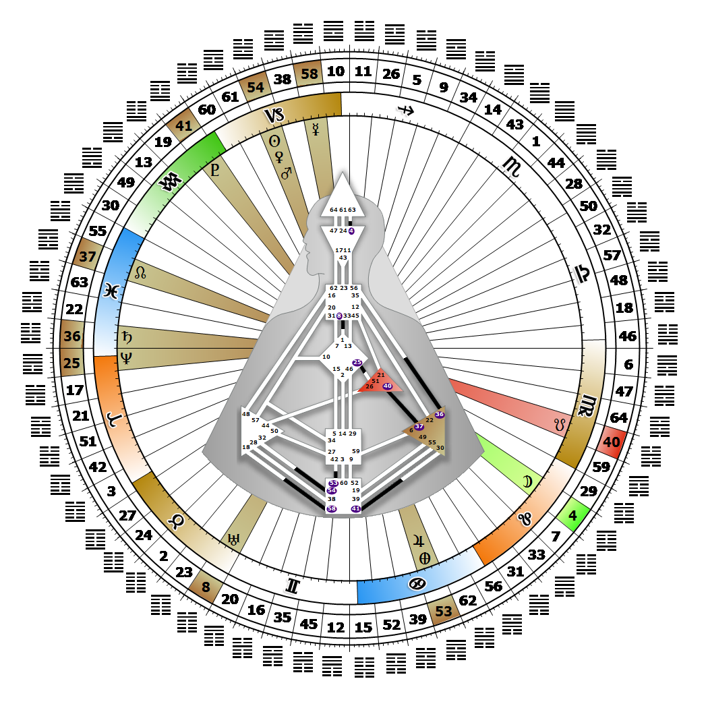

# Gate 54 - The Marrying Maiden

**January 06, 2026**

## *Gate of Ambition - The Drive to RIse Up*

> Interaction in its mundane social context but also one's mystical and cosmic relationships. Transformation is possible through the mastering of instincts.

### Right Angle Cross of Penetration 4 | Godhead - Vishnu

*Quarter of Mutation,  the Realm of SiriusTheme: Purpose fulfilled through TransformationMystical Theme: Accepting Death*

---

This Gate is part of the Channel of Transformation, A Design of Being Driven, linking the Root Center (Gate 54) to the Splenic Center (Gate 32). Gate 54 is part of the Tribal (Ego) Circuit with the keynote of support.

Gate 54 provides humanity with the fuel and ambition to transform the Tribe's material direction and standing among other tribes. It supplies the energy for our most mundane ambitions, and the highest spiritual aspirations that may be hidden within them. Only when we have mastered our instincts to thrive on the mundane plane, is transformation of a spiritual nature possible. We live our spiritual ideals through the mundane plane, and ambition is the fulfillment of our personal potential. If someone notices us higher up in the hierarchy, there is a good chance that we can better our position in life. Our inner drive to 'rise up' provides the impetus for transformation for those around us as well; it levels the playing field for others to compete on equal terms. Our drive needs direction, however, so we naturally look to someone with Gate 32 to channel our ambitions toward something of lasting value. Without this direction, our drive may turn into blind ambition.

---

### Line 1 - Influence

**☀️ Exaltation:** The ability to achieve influence through secret relationships, anywhere from the private adviser to the Satanist. Ambition energized through secret relationships which fuel influence.

**🌑 Detriment:** A socially misguided insistence on formal recognition of a relationship, that in terms of influence, will diminish its power. Ambition which demands formal recognition limiting influence.
