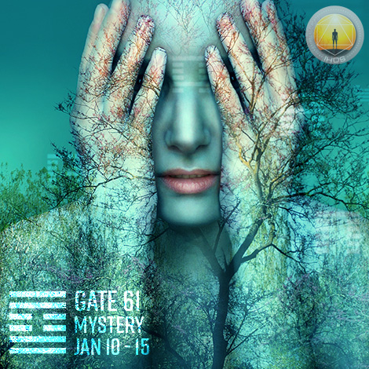
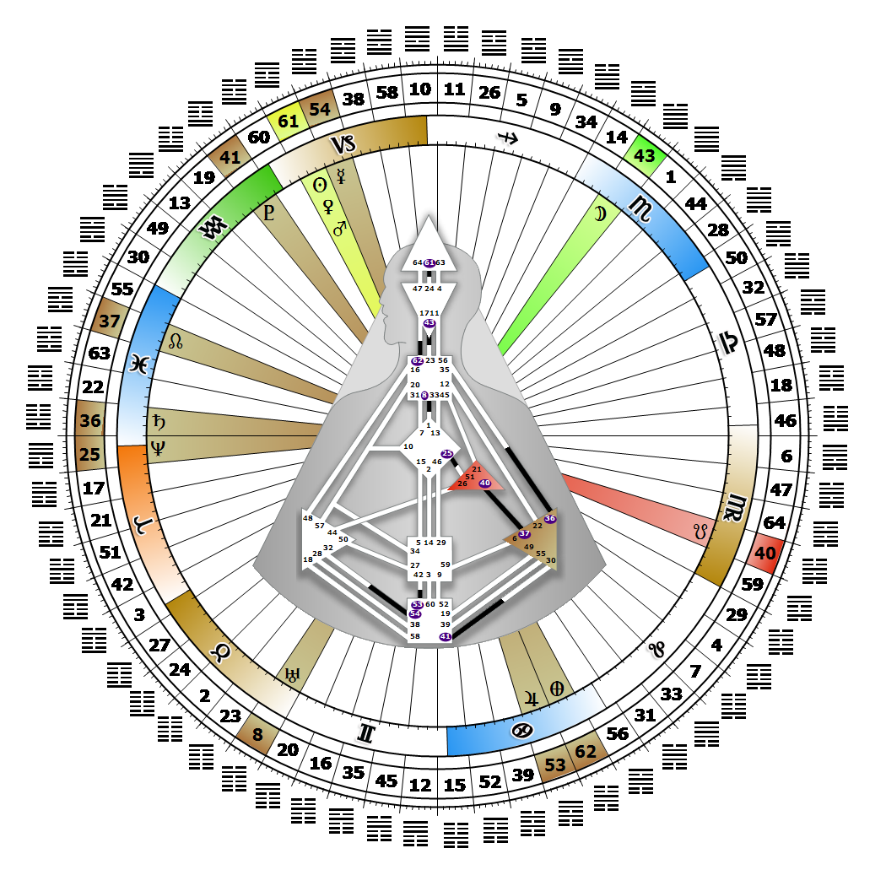

# 閘門 61 - 內在真理

**2026年01月16日**

## *神秘之門 - 內在真理的潛能是靜默*

> 對宇宙根本法則的覺知。知曉絕對真理、生命奧秘的壓力，以及解決個體求知張力的驅動力。

### 左角度交叉之隱匿 2 | 神性 - 命運之輪的守護者

*突變之季，天狼星領域
主題：透過轉化實現目的
神秘主題：接納死亡*

---

此閘門屬於「覺知通道」（A Design of the Thinker），連結頭頂中心（Gate 61）與邏輯中心（Gate 24）。Gate 61 屬於個體（知曉）迴路，其核心主題為「賦能」。

Gate 61 代表著知曉的壓力、解開奧秘的驅動力，以及透過絕對領悟的獨特時刻來啟發他人。這種「知曉」推動我們走向更深層的自我接納，從而擁抱那些使我們與眾不同的特質。我們喜愛沉浸於沉思，在精神層面探索未知。當我們「知曉」自己擁有獨特洞見，並等待適當時機表達時，會感受到解放。當我們的知曉能啟發、賦能或觸動他人轉變時，我們便感受到力量湧現。

相較於集體意識總是聚焦過去已發生之事或預測未來可能之事，我們的個體意識渴望當下的靜默，期盼所有聲音與對話止息。若我們屈服於這股強烈壓力，任憑未知侵擾心神，我們的靈感可能被妄念混淆，導致深層的不確定與焦慮。秘訣在於享受思考過程，讓內在知曉與內在真理，以其獨特的時機自然顯現。若未連接 Gate 24，我們並非被設計來解開謎題，而僅是單純享受探索之趣。

---

### 第6行 - 吸引力

**☀️ 高階表達:** 對集體意識的深刻調諧，能夠引導大眾趨向真理。這份啟發能為群體帶來清晰的洞見。

**🌑 低階表達:** 依賴那些陳腔濫調的口號與標語，即便它們在能量層面上看似新穎，最終仍難逃無人聞問的命運。那種以為靈感能為群體帶來清晰視野的錯覺，不過是自欺欺人罷了。
