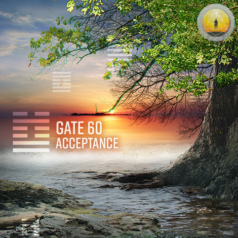
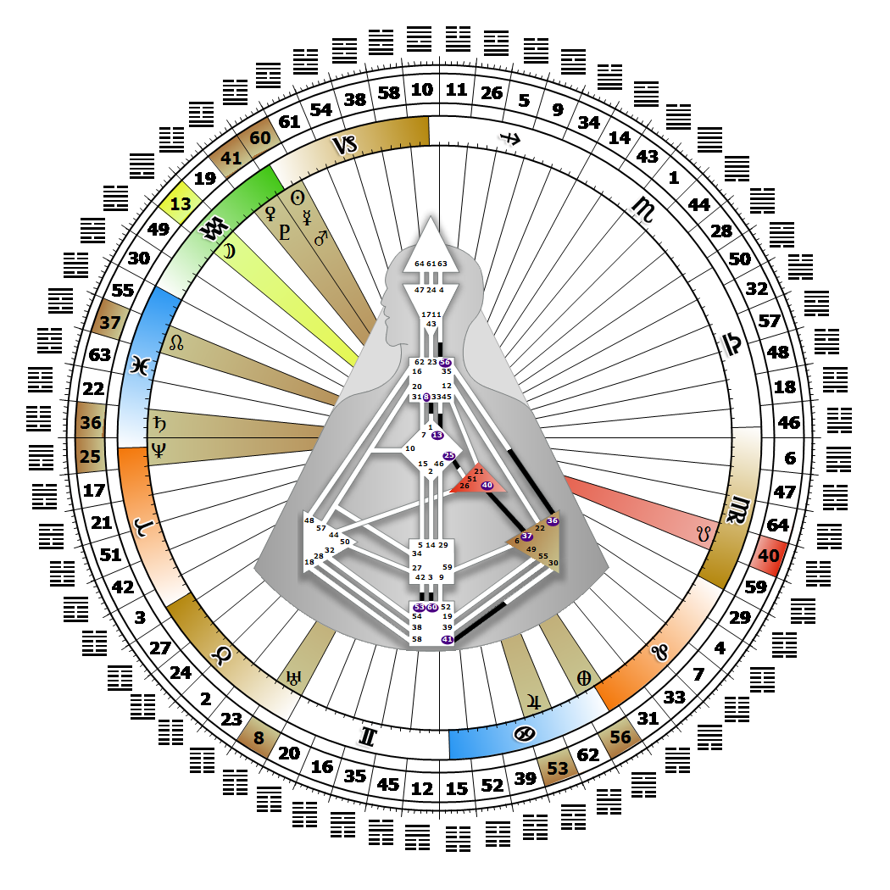

# Gate 60 - Limitation

**January 17, 2026**

## *Gate of Acceptance - The Pulsing Pressure to Mutate*

> The acceptance of limitation is the first step in transcendence. It is the 'space between' where mutation takes place. Mutation is released in limited amounts.

### Right Angle Cross of Laws 4 | Godhead - Keepers of the Wheel

*Quarter of Mutation,  the Realm of SiriusTheme: Purpose fulfilled through TransformationMystical Theme: Accepting Death*

---

This Gate is part of the Channel of Mutation, Energy That Fluctuates and Initiates, linking the Root Center (Gate 60) with the Sacral Center (Gate 3). Gate 60 is part of the Individual (Knowing) Circuit with the keynote of empowerment.

Gate 60 creates the pressure needed for pure energy to mutate into form. Here the Root Center fuels restraint, which enables the pressure to build under each possibility. The creative mutative process is subject to a pulse, and we never know when something that has the potential to become a mutation will be released. A viable mutation transcends existing limitations when it is empowered. Mutation takes place in the 'space between the notes' created by the on-off pulse of the 60th gate. The pressure from our Root Center creates a deep restlessness in us to move ahead, and limitations of any kind may feel like roadblocks. If we become impatient with the unpredictable mutative process, however, the melancholy inherent in the 60th gate can deepen and become chronic depression. When we feel we cannot affect change around us, look inward. Accept the mystery of the mutative process and trust that transformation is occurring within us, and because of us, in the world around us. Gate 3 plays a key role in bringing order to the potential chaos that comes from the mutation. Without it we can feel unable to move forward.

---

### Line 1 - Acceptance

**☀️ Exaltation:** The ability to maintain inner harmony when confronted by external limitations. Harmonic energy that can deal with external limitations.

**🌑 Detriment:** The drive for diversity, that when limited can become restless and agitated. Restless energy when confronted with external limitations.
