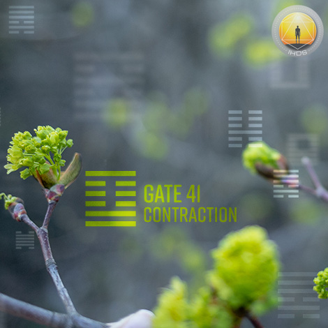
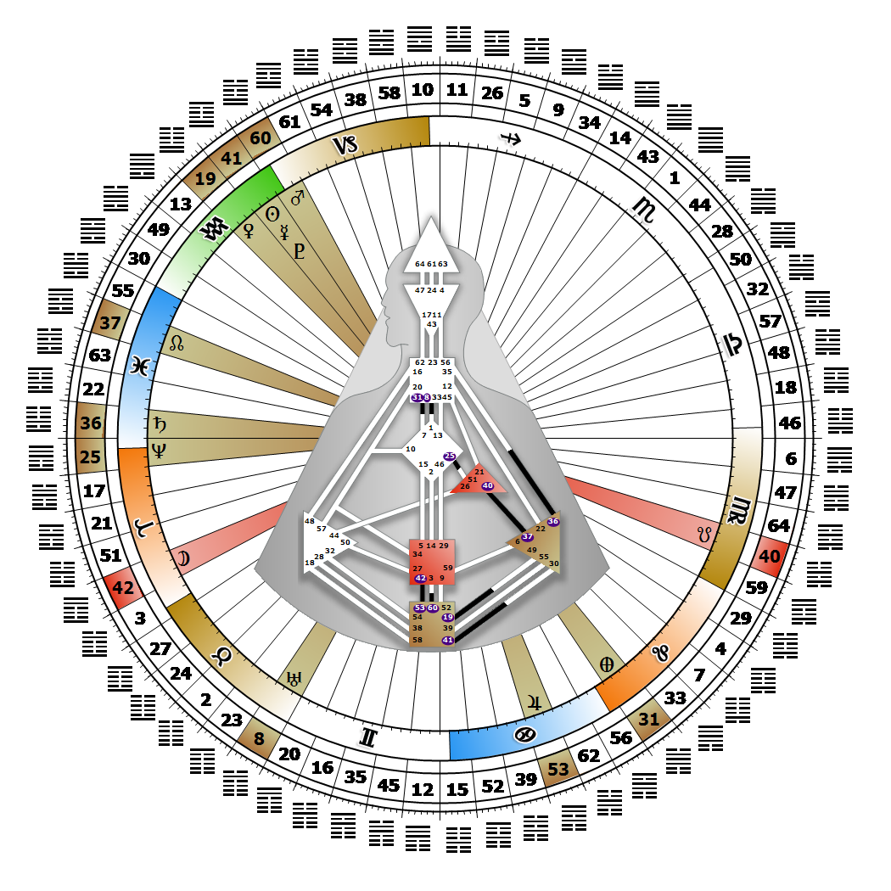

# Gate 41 - Decrease

**January 27, 2026**

## *Gate of Contraction - Patience is the Great Virtue*

> The limitation of resources which maximizes the development of potential. Fantasizing and recognizing the one feeling of value begins the next cycle.

### Left Angle Cross of the Alpha 2 | Godhead - Keepers of the Wheel

*Quarter of Mutation,  the Realm of SiriusTheme: Purpose fulfilled through TransformationMystical Theme: Accepting Death*

---

This Gate is part of the Channel of Recognition, A Design of Focused Energy, linking the Root Center (Gate 41) with the Solar Plexus (Gate 30). Gate 41 is part of the Collective Sensing (Abstract) Circuit with the keynote of sharing.

Gate 41 initiates the uniquely human experiential way as a hunger to experience emotion. It begins with the desire to interact with others through feelings. When this initiating Root pressure of desire builds, it may manifest as a vague expectation, a sexual fantasy, or a restless need to experience something new with someone. We can't be sure what this new experience is or when it will happen or with whom. Gate 41 drives us toward satisfying our desires and fulfilling our destiny, both of which rest in the hands of the fates (Gate 30.) We may bring balance to this unfocused and often confusing restlessness by writing or daydreaming about what it might be like to fulfill our wildest desires, or by vicariously experiencing them through literature and movies. Gate 41 holds the potential for all human experiences, but releases or initiates only one at a time. This is its limitation, and ours. Each new experience that we enter into through our Strategy and Authority holds a promise that a new feeling awaits discovery. By letting go of expectations, we can move freely through each encounter and avoid becoming pessimistic about future ones. Without Gate 30 there is a feeling of wanting something, but not knowing what it is that we want.

---

### Line 6 - Contagion

**☀️ Exaltation:** The maximization of the potential of form. The father whose success will benefit his children. The fuel for recognition through feelings.

**🌑 Detriment:** The tendency in transcendence to keep it a secret in fear of being deprived of its special advantages. The fuel for secret or repressed feelings.
