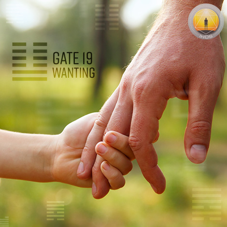
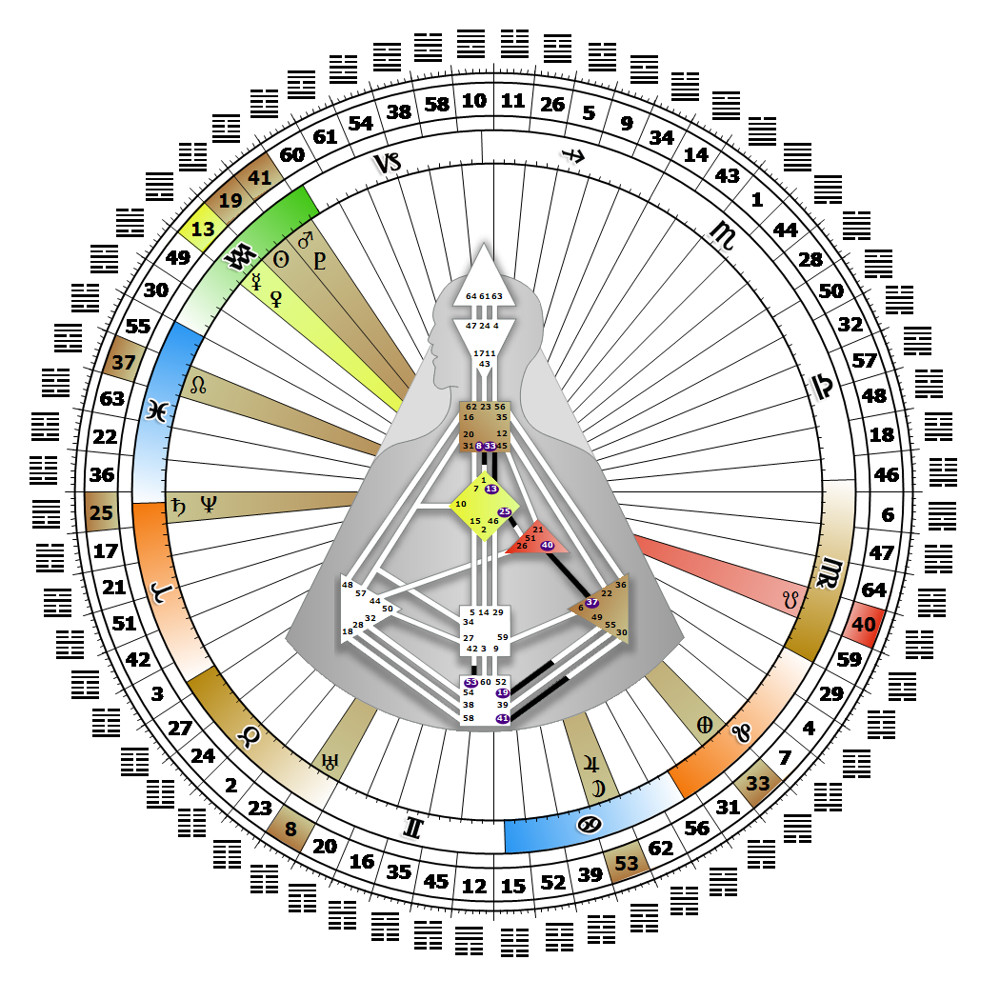

# Gate 19 - Approach

**January 29, 2026**

## *Gate of Wanting - Fuel for our Social Needs*

> That all things interrelated is apparent and manifested through the action of approach. The fuel of the sensitivity process. The source that drives all revolutions.

### Right Angle Cross of the Four Ways 4 | Godhead - Keepers of the Wheel

*Quarter of Mutation,  the Realm of SiriusTheme: Purpose fulfilled through TransformationMystical Theme: Accepting Death*

---

This Gate is part of the Channel of Synthesis, A Design of Being Sensitive, linking the Root Center (Gate 19) to the Solar Plexus Center (Gate 49). Gate 19 is part of the Tribal (Ego) Circuit with the keynote of support.

Gate 19 fuels two essential human mandates: the need to have access to basic resources like food and shelter, and the need for spirit. These mandates set us up to interact or bond with others in specific ways. When everyone has enough to eat, a place to live and a god to worship, we experience life as one healthy community, supporting each other and making our unique contribution to the whole. When there is want or need or great inequality in our tribe, communal support breaks down and nothing works. We are here to be alert and sensitive to which resources are being withheld from our family, community and eventually the global community. We bring others to an awareness of what resources are needed for everyone to survive, as well as thrive and achieve their personal or communal potential. The way we go about this depends on the specific line(s) defined in our chart, but the process usually requires enticing or bargaining with the people or institutions who share our principles, and possess or control what is needed. We know what is needed, and look to Gate 49 to fulfill those needs. The consequences of turning the Root Center's pressure inward are experienced as oversensitivity, an addiction to being needed, or personal neediness as in "Doesn't anyone care about me? When will I get my needs met?"

---

### Line 2 - Service

**☀️ Exaltation:** Dedication and service to the highest values. The energy to want to be of service.

**🌑 Detriment:** Protracted indecision, but given the nature of this position, eventual compliance. The need to be wanted that will eventually turn its energy to service.
