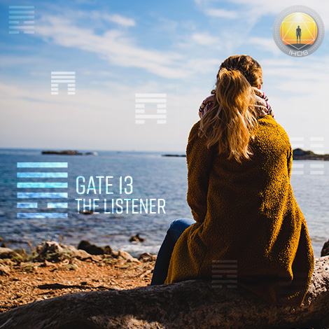
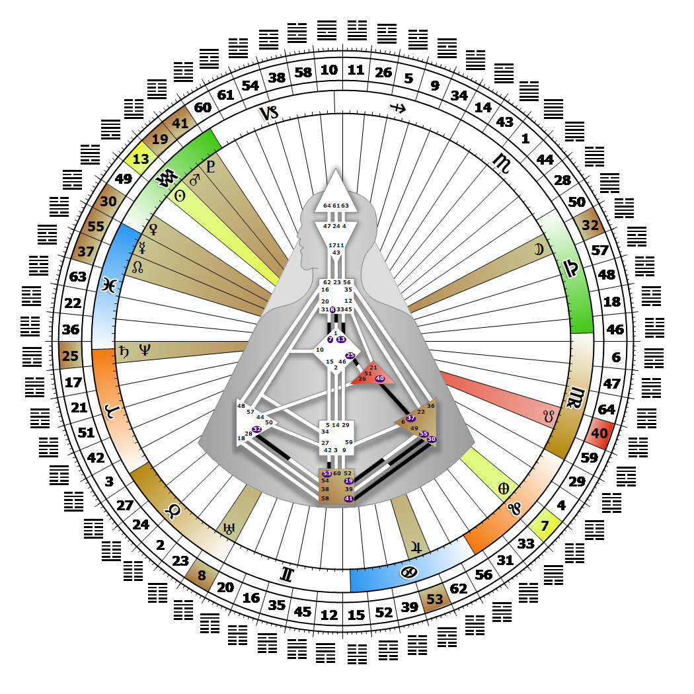

# 閘門 13 - 人類的夥伴關係

**2026年02月07日**

## *傾聽者之門 - 秘密的聆聽者*

> 在一個有序的框架中體現普世理念與價值觀，從而激發人文主義的合作精神。過往循環的知識將積累成為記憶。

### 左角度交叉之面具 | 神性 - 卡利

*起始之季，昴宿星團之境
主題：透過心智實現目標
神秘主題：見證者歸來*

---

此閘門隸屬於「浪子通道」（The Prodigal），即「見證者設計」（Design of the Witness），連結 G 中心（閘門 13）與喉嚨中心（閘門 33）。閘門 13 屬於集體感知迴路（抽象迴路），其核心主題是「分享」。

憑藉聆聽、觀察與儲存秘密的天賦，閘門 13 作為傾聽者，維繫著過去與未來的連續性。在此行運期間，會呈現「密友」與「秘密守護者」的主題。人們自然會向那些真正樂於聆聽故事、冒險、勝利與挑戰的人分享自身經歷。擁有此閘門的人，能安然將他人分享的內容珍藏於心。閘門 13 不會受喉嚨中心驅使而急於表達。我們將辨識出最適切的時機，分享記憶中最珍貴的部分——因為這些內容將被懂得篩選、反思並整合的人（例如擁有閘門 33 者）引導出來，傳遞給更廣大的群體。那些唯有透過親身經歷才能領悟的重要課題，會被悉心珍藏，直到時機成熟，才貢獻於人類對自身的理解。歷史的延續性形塑著我們作為物種的未來。若無閘門 33，秘密或許永無分享之日。

---

### 第6爻 - 樂觀主義者

**☀️ 高階表達:** 堅持不懈的能量。無限的希望。相信敞開心扉將帶來更美好關係的期許。

**🌑 低階表達:** 天真。將相互利益轉化為普遍性的詮釋。相信相互利益能夠投射於他人身上。
