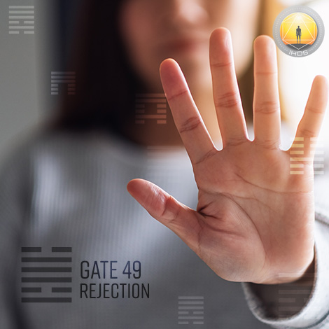
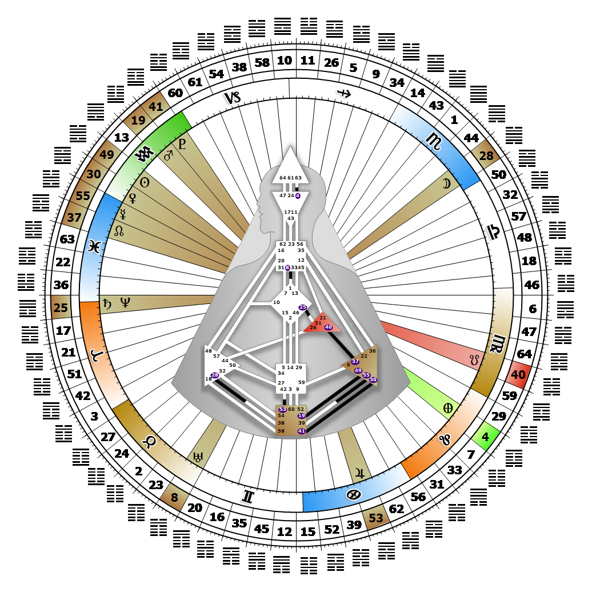

# Gate 49 - Revolution

**February 13, 2026**

## *Gate of Rejection - Potentially Aware and Ritualistically Spiritual*

> Ideally the transformation of forms based on the highest principles and not simply for power. Knowing what and who is needed or not for the community.

### Left Angle Cross of Revolution | Godhead - Kali

*Quarter of Initiation,  the Realm of AlcyoneTheme: Purpose fulfilled through MindMystical Theme: The Witness Returns*

---

This Gate is part of the Channel of Synthesis, A Design of Being Sensitive, linking the Solar Plexus Center (Gate 49) with the Root Center (Gate 19). Gate 49 is part of the Tribal (Ego) Circuit with the keynote of support.

The principles of acceptance and rejection, marriage and divorce, and ultimately revolution, are the direct result of living with Tribal hierarchies influenced by the emotional wave. Because Gate 49 places us at the top of one of these hierarchies, we feel a need to be obeyed. This translates into us exerting the power to accept or reject a person, or their request for access to our resources, or their appeal to initiate a revolution on their own or someone else's behalf. Our sensitivity or insensitivity towards other people (and animals) and their specific needs is based on a resonance with our own principles. In other words, the people we accept into our circle are those willing to stand by us and support our principles; the rest we will be inclined to reject. Ours is a social agenda for change and reformation. It is particularly focused on food and food distribution; people who have enough to eat don't need to go to war. Revolution is either avoided by filling needs, or entered into as a necessary evil and last resort. We might be the one whose acceptance or rejection influences which road is taken to satisfy the needy party. The things that make us nervous are the fear of rejection and the consequences of unpredictability.

---

### Line 6 - Attraction

**☀️ Exaltation:** An innate impressionability that transforms the fence-sitter into the committed. The sensitivity and potential to embrace and transform others.

**🌑 Detriment:** Stubborn, and often fatal, rejectionism. Oversensitivity that leads to rejection of principles and others as a rule.
