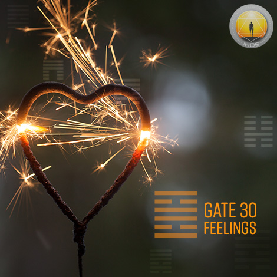
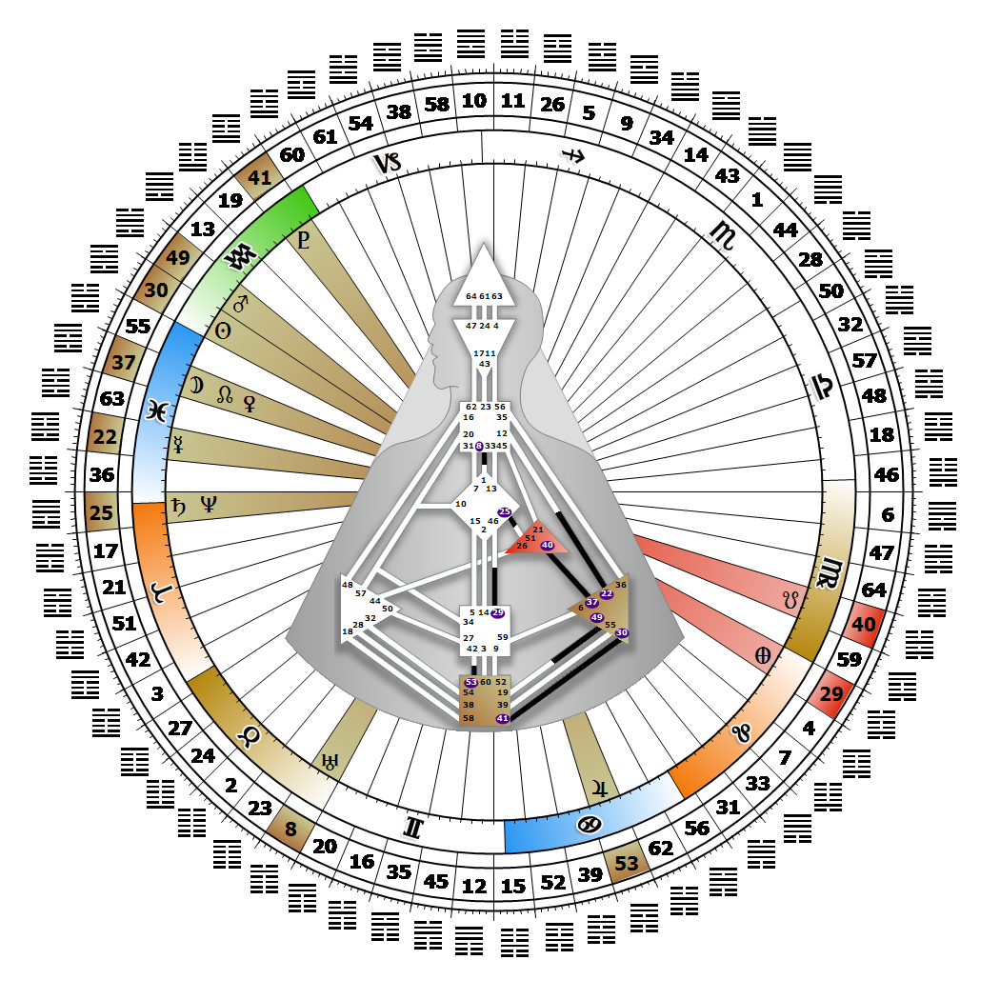

# Gate 30 - The Clinging Fire

**February 16, 2026**

## *Gate of Feelings - Surrendering to Fate*

> Freedom recognized as an illusion and limitation accepted as fate. Emotional awareness lies between hope and pain.

### Right Angle Cross of Contagion, Juxtaposition Cross of Fates | Godhead - Kali

*Quarter of Initiation,  the Realm of AlcyoneTheme: Purpose fulfilled through MindMystical Theme: The Witness Returns*

---

This Gate is part of the Channel of Recognition, A Design of Focused Energy, linking the Solar Plexus Center (Gate 30) to the Root Center (Gate 41). Gate 30 is part of the Collective Sensing (Abstract) Circuit with the keynote of sharing.

The Gate of the Fates teaches us that life is not what we expect it to be - it is what we allow it to be. Experiences are conceived from a desire that then meets life on the highs and lows of our emotional wave. This desire can feel like an obsessive hunger that weaves the yearnings of different lives together, influencing our every interaction until it is satisfied or fulfilled. The only control we have is over the clarity with which we enter into each experience, not over the outcome. Because desire can only be temporarily assuaged, life without clarity becomes a wild emotional ride. Over time, we see that the freedom to fulfill our wildest dreams is merely an illusion, and unreciprocated desire should not be taken personally. Balance in our life comes through surrender, through accepting what is. In doing so, we need not fear the fates or feel pressured to chase after the fantasies of Gate 41. By accepting our limitation, or place in the larger pattern of life, our reflections on feeling and desiring deeply while experiencing our humanness become a gift to be shared with others.

---

### Line 4 - Burnout

**☀️ Exaltation:** A compulsive and hyperactive nature that carries all the earmarks of burnout but doesn't necessarily arrive at it. A positive outcome is often assisted through analysis. Highly energized feelings that may lead to emotional collapse.

**🌑 Detriment:** Uncontrollable expansion with the inevitable bursting of the bubble. Uncontrollable feelings and accompanying emotional outbursts.
