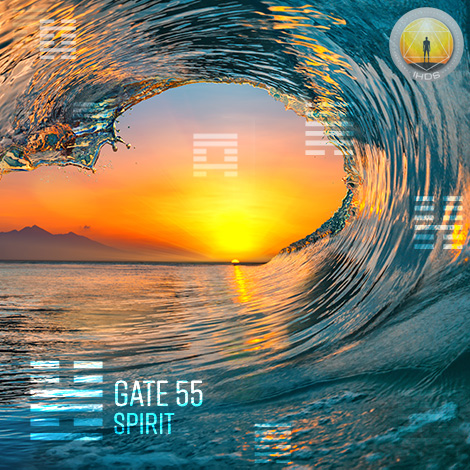
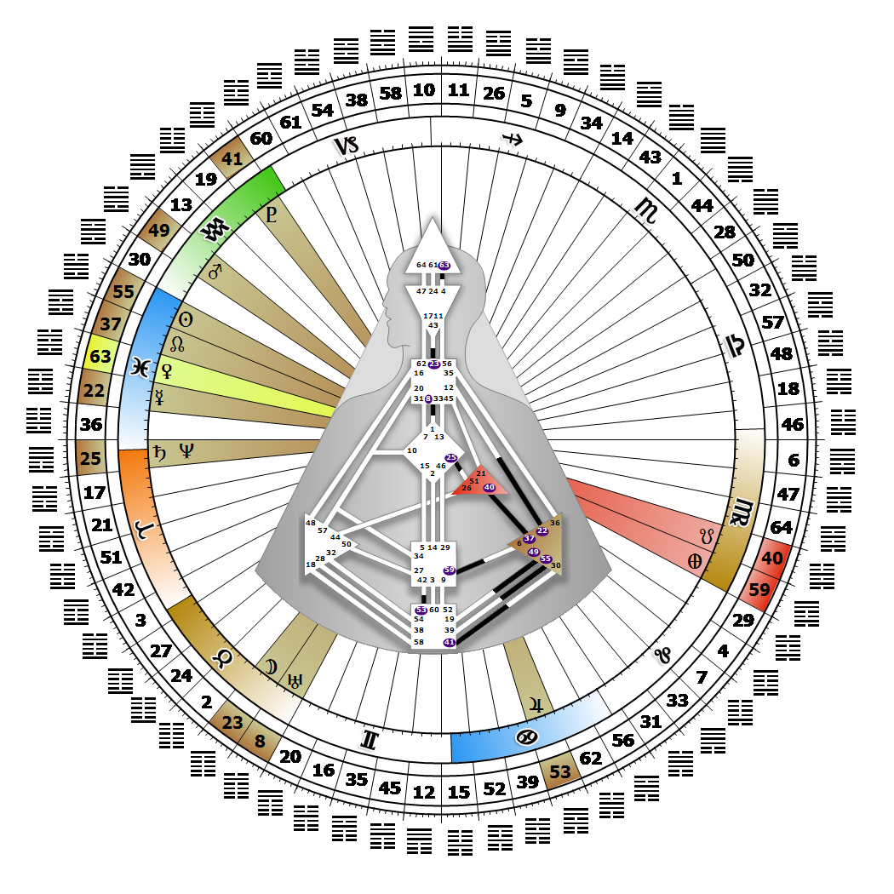

# 閘門 55 - 豐盛之門

**2026年02月24日**

## *靈性之門（Gate of Spirit）——靈性的本質存在於情感的當下*

> 豐盛純然是精神層次的課題。在任何時刻，精神都不該是比較而來的，而應是對於杯子（生命）存在本身所感受到的驚嘆。

### 左角度交叉之靈性 | 神性 - 卡利

*起始之季，昴宿星團領域
主題：透過心智實現目標
神秘主題：見證者歸來*

---

此閘門隸屬於「情緒波動通道」（A Design of Moodiness），連結情緒中心（Solar Plexus，第55號閘門）與根部中心（Root Center，第39號閘門）。第55號閘門屬於「個體迴路」（Individual Circuit，又稱知曉迴路），其核心主題為「賦能」。

對精神的覺知並非概念（Ajna，眉心輪）或本能（Spleen，脾中心）——它是一種情緒（Solar Plexus，情緒中心）。豐盛是精神的功能；它關乎我們如何感知當下的感受，以及此刻正體驗的情緒狀態。第55號閘門易受情緒波中憂鬱化學物質的影響，這種波動持續在希望與痛苦間循環。有時我們覺得杯子半空，下一刻又感覺它半滿。我們的情緒決定了什麼對我們是正確的、何時是正確的。若當下沒有進食、工作、親密互動、社交或創造的心情，勉強為之對健康並無益處。當我們想獨處時，無需試圖解釋或找藉口；只需尊重這份情緒，擁抱當下與內在創造性自我的共處。我們最具創造力的時刻，往往發生在深沈憂鬱的狀態中。當我們單純不想社交時，向周圍的人表達一句體貼的說明，能幫助他們不將從我們身上感受到的情緒能量個人化。我們對擁有第39號閘門的人保持開放，因為他們的觸動能讓我們感知自身的精神與情緒狀態。在情緒波的任何階段，我們的精神感受與情緒表達皆無需與他人比較、爭辯或受其影響。精神覺知源自於對「杯子存在本身」的驚嘆。我們最恐懼的，是情緒的空洞或生命中熱情的匱乏。

---

### 第6行 - 自私

**☀️ 高階表達:** 儘管疏離卻仍間接為他人帶來物質利益的獲取執念。透過物質主義尋得精神的可能性。

**🌑 低階表達:** 物質豐饒存在之處，卻無人得以共享其光芒。此即「無月」之相。物質主義可能演變為執念，伴隨著不願分享的「吝嗇」心態。
