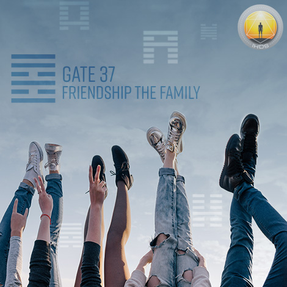
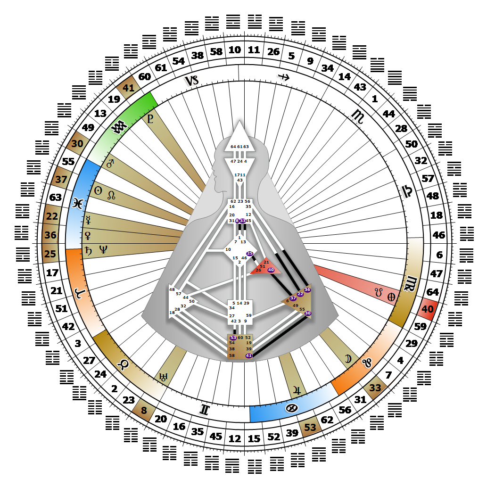

# 閘門 37 - 家庭

**2026年02月25日**

## *友誼之門 - 準備接納外來者*

> 社群有機本質在宏觀與微觀層面的顯現。革命潛在敏感性的超個人表達。

### 右角度交叉之規劃 | 神性 - 密特拉

*起始之季，昴宿星團領域
主題：透過心智實現目標
神秘主題：見證者歸來*

---

此閘門隸屬於「社群通道」，屬於「尋求整體歸屬的設計」，連結太陽神經叢中心（第37號閘門）與自我中心（第40號閘門）。第37號閘門屬於部落（自我）迴路群，其核心主題為「支持」。

第37號閘門是人體圖中最具社群性的閘門。當他人認可我們的力量時，我們能以自身的溫暖、友善與滋養特質，凝聚家庭與社群。我們擁有透過觸碰與他人建立情感連結的能力，並具備非凡的敏感度，能感知他人是否願意接納或對我們敞開心扉。人們常希望我們成為組織的代表，負責迎接新成員或陌生人。若各方明確達成協議，且回報條件足夠豐厚，我們通常會欣然接受這樣的提議。第37號閘門對應「口部」，因此規劃、籌備與製作食物，往往在家庭與社群聚會中扮演核心角色。在第37號與第40號閘門的協作中，第40號閘門是資源的提供者，而我們則是其資產與技能的分配者。若缺乏第40號閘門的能量，我們會持續尋找能為社群提供必要資源的對象，以便擁有協商夥伴與可分配的資源。我們最深的恐懼，是受困於傳統部落角色，或被迫符合其期待。

---

### 第2行 - 責任

**☀️ 高階表達:** 理解個人責任原則作為成功合作的基礎。透過個人責任實現友誼的可能性。

**🌑 低階表達:** 傾向於指出他人的責任。友誼可能導致指出他人責任的情況。
