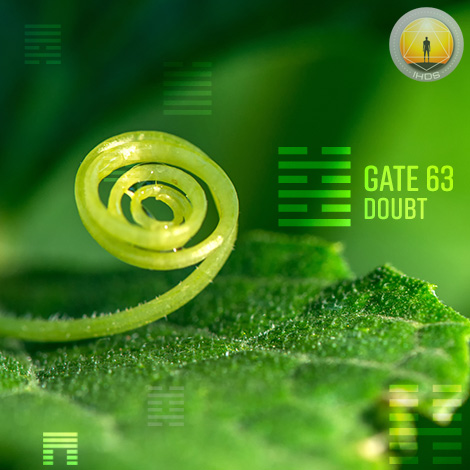
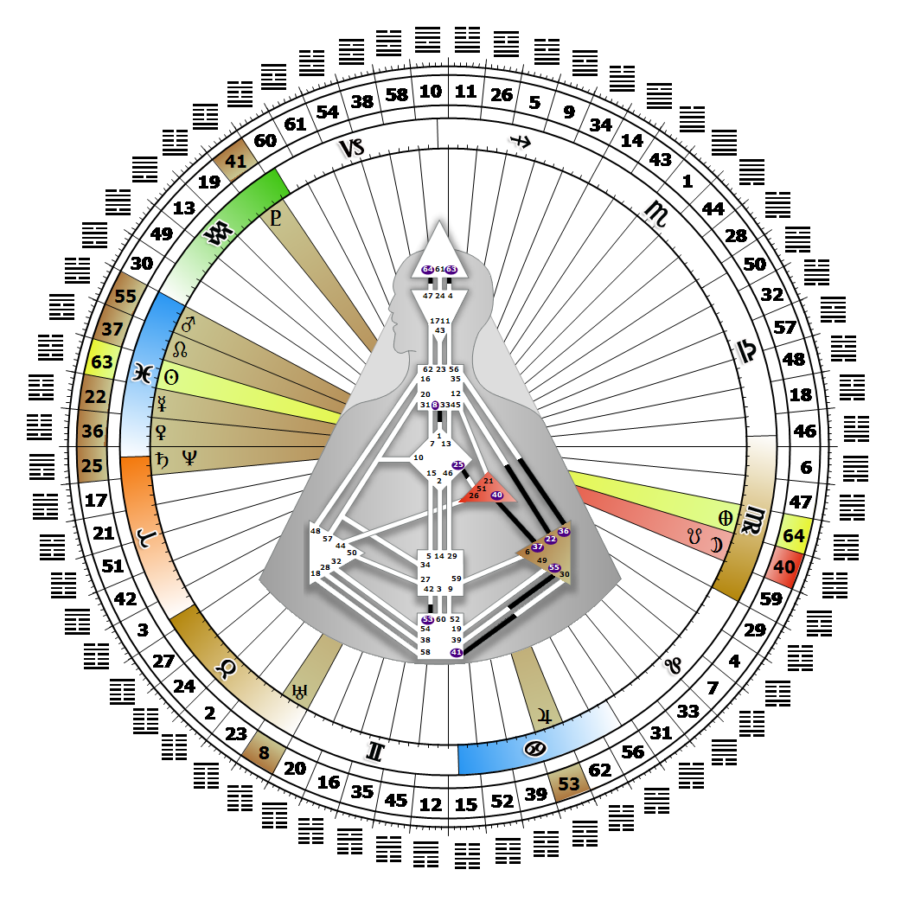

# 閘門 63 - 完成之後

**2026年03月03日**

## *懷疑之門（Gate of Doubt）——懷疑是必要的靈感源泉*

> 在生命的螺旋中，所有終點皆是起點。未來取決於能否確立某種模式的真實性。而驅動這一切的燃料，正是質疑。

### 右角度交叉之覺知｜神性 - 密特拉

*起始之季，昴宿星團之境
主題：透過心智實現目標
神秘主題：見證者歸來*

---

此閘門（Gate）屬於邏輯通道（Channel of Logic），即「混合懷疑的心智舒適設計」，連結頭頂中心（Head Center，Gate 63）與眉心中心（Ajna Center，Gate 4）。Gate 63 隸屬於集體理解（邏輯）迴路（Collective Understanding Circuit），其核心精神在於分享。

Gate 63 的猜疑或懷疑僅是一種壓力源；它代表一種準備狀態，促使我們去關注並質疑那些令人感到不安的事物，直到能從未來安全性的角度加以理解與評估。當我們察覺到推動生命前進的既有模式中存在矛盾或弱點時，懷疑便油然而生。這是理解／邏輯過程中不可或缺的要素，而邏輯正是串聯並連結地球上所有生命形式的共同脈絡。Gate 63 的懷疑可能向外投射至世界，也可能不恰當地向內聚焦於我們自身的生活與選擇。我們的懷疑會化為一種迫切性，驅使我們對不明確的事物提出具體疑問。若無法獲得充分、合理且可行的解答，猜疑形式的壓力將持續累積。我們專注於未來，並能洞察當下既存的模式，這意味著若某事物顯得薄弱、經不起邏輯審視，或無法保障社會的未來，我們便會捨棄它、轉向其他模式。當我們參與團體的長期規劃時，自身氣場將為腦力激盪過程注入這股帶壓力的能量，協助構思答案，將各種可能性投射至未來。若缺乏 Gate 4 的平衡，我們對生命迫切問題的解答需求，可能引發心智上的焦慮。

---

### 第 2 行 - 結構化

**☀️ 高階表達:** 建立一個大型框架，藉此擴展並分享成就；在維持方向掌控權的同時，對他人的貢獻給予回報。在保持控制的前提下，承受著必須與他人分享自身疑慮的壓力。

**🌑 低階表達:** 在成就上的不穩定，當處於權威地位時會導致傲慢，並渴望將他人排除在權力中心之外。對成就的懷疑可能導致對他人的猜疑。
