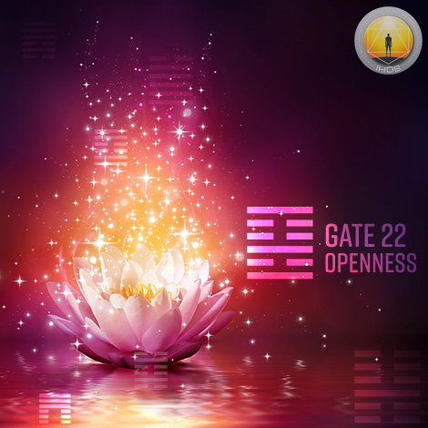
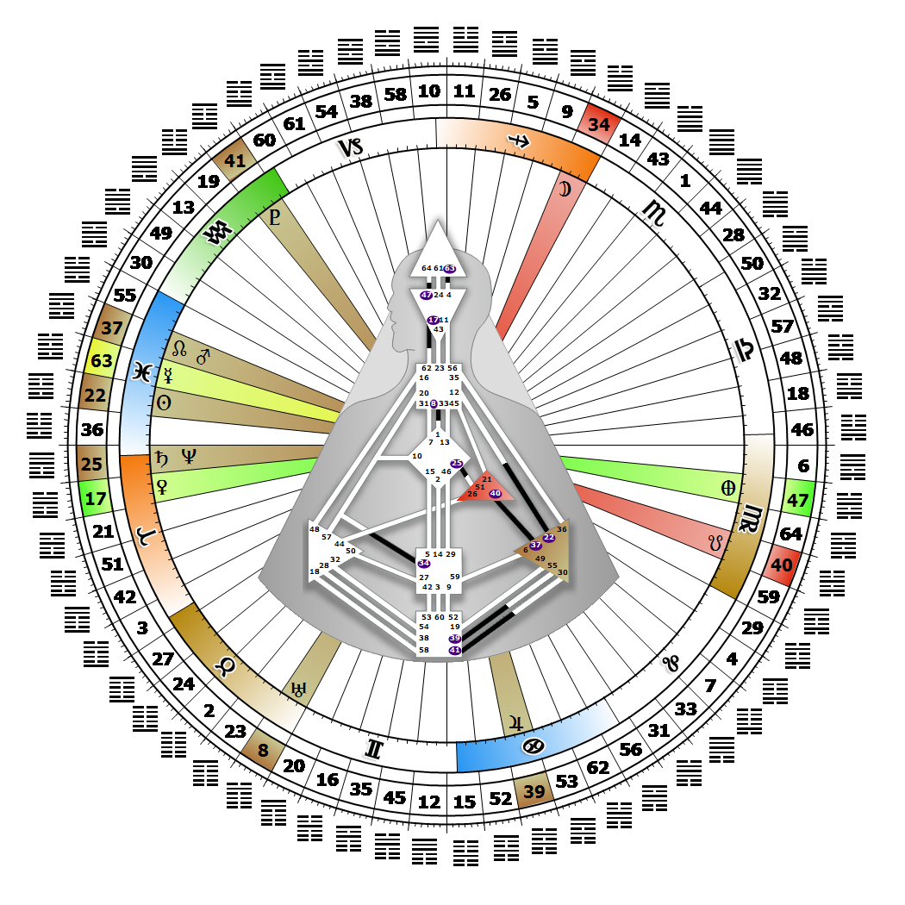

# Gate 22 - Grace

**March 10, 2026**

## *Gate of Openness - Sharing Spirit with Others*

> A quality of behavior best suited in handling mundane and trivial situations. The emotional spirit conditions how receptive others will be to mutation.

### Right Angle Cross of Rulership | Godhead - Mitra

*Quarter of Initiation,  the Realm of AlcyoneTheme: Purpose fulfilled through MindMystical Theme: The Witness Returns*

---

This Gate is part of the Channel of Openness, The Design of the Social Being, linking the Throat Center (Gate 12) to the Solar Plexus Center (Gate 22). Gate 22 is part of the Individual (Knowing) Circuit with the keynote of empowerment.

Gate 22 combines the potential for emotional openness through listening, with a social grace and charm that is highly attractive to others, when it is in the right mood. When our mood changes, however, a dramatically different and sometimes antisocial side of us may emerge. Our emotional awareness matures over time as we become comfortable with moving into our depth along the emotional wave. By allowing our depth to mellow with age in the company of our creative muse, we refine our timing and release our truth precisely when society is ready for it. Recognizing and acting on that timing is dependent on honoring our mood. Our openness, and our attentiveness to what is essential and new for others, are gifts of grace which even impact strangers.

Those who carry this gate listen to others until they complete what they are saying, making what they have to say naturally come second. This is grace in action, as well as the key to our own empowerment. In fact, it is our responsibility and privilege to use our social listening skills in a way that makes change available to others. Without the 12th gate, we may know what we feel, but not how to express it verbally. Because silence makes us nervous, what we fear most is that there is nothing worthwhile to listen to.

---

### Line 3 - The enchanter

**☀️ Exaltation:** Form as a definition and actualization of substance. The possibility for perfected openness through the alignment of emotional energy and awareness.

**🌑 Detriment:** Unconscious grace. An innate openness.
