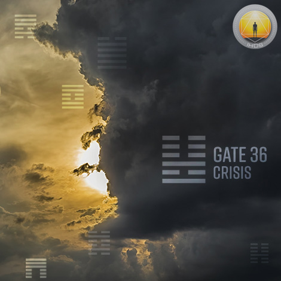
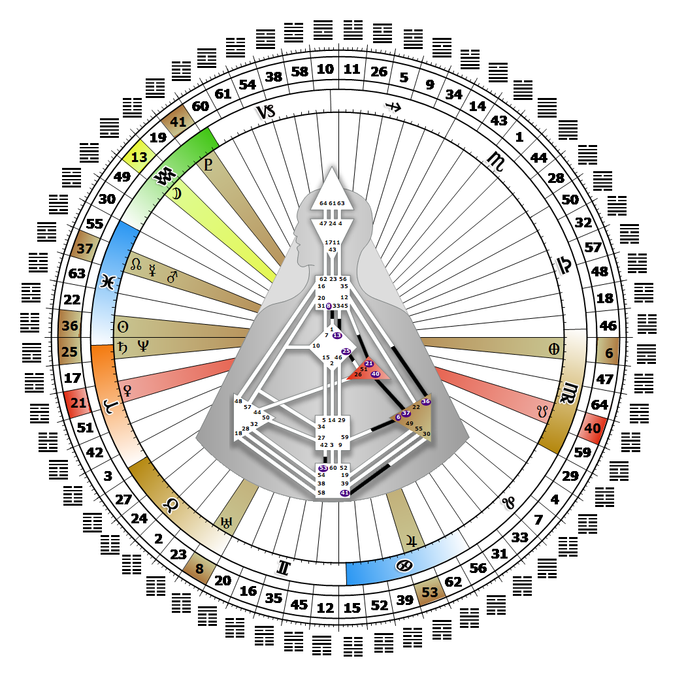

# Gate 36 - The Darkening of the Light

**March 16, 2026**

## *Gate of Crisis - Wait for Emotional Clarity*

> The rule of cycles in which decline is a natural but not enduring stage. Action without awareness leads to emotional crisis. A shift of feeling is the end of a cycle.

### Right Angle Cross of Eden, Juxtaposition Cross of Crisis | Godhead - Mitra

*Quarter of Initiation,  the Realm of AlcyoneTheme: Purpose fulfilled through MindMystical Theme: The Witness Returns*

---

This Gate is part of the Channel of Transitoriness, A Design of a 'Jack of All Trades', linking the Solar Plexus Center (Gate 36) to the Throat Center (Gate 35). Gate 36 is part of the Collective Sensing (Abstract) Circuit with the keynote of sharing.

Gate 36 is the place where our fears of vulnerability and inexperience (emotional and sexual) are resolved or transformed into experience; where we create and meet the challenges of change and growth through emotional crises. As we gain emotional clarity over time, we learn how to handle emotional crises created by others, and we create less of them ourselves. Gate 36 restrains the strong hope-to-pain wave that drives human experience toward change. Its energy is aimed directly at the Throat Center, which means that the full range and depth of our emotions are being readied for manifestation. All that is needed is someone or something to trigger their release.

Without Gate 35 to provide a proper outlet or give a focused direction to this energy, it can be experienced as a personal crisis. We learn over time to remain steady by patiently adapting to constantly changing feelings. These feelings can prove to be wonderfully stimulating and natural for us to express, or overwhelming to us and uncomfortable for others. Either way let them unfold, as this is how we reach for our emotional depth in order to access our own truth. Without Gate 35, feeling inadequate and unable to fulfill our own expectations makes us nervous.

---

### Line 4 - Espionage

**☀️ Exaltation:** The ability to prepare for and anticipate decline through the accumulation of secret or privileged information. The realization that knowledge both covert and esoteric is necessary, if one is to be prepared for crisis and change.

**🌑 Detriment:** The tendency in recognizing the strengths of the opposition to accept the inevitability of decline and rather than resist, to offer one's services to guarantee survival. The double agent. Crisis knowledge that is available to others for a price.
