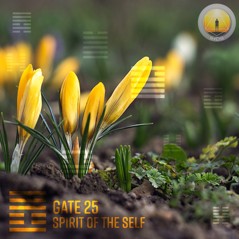
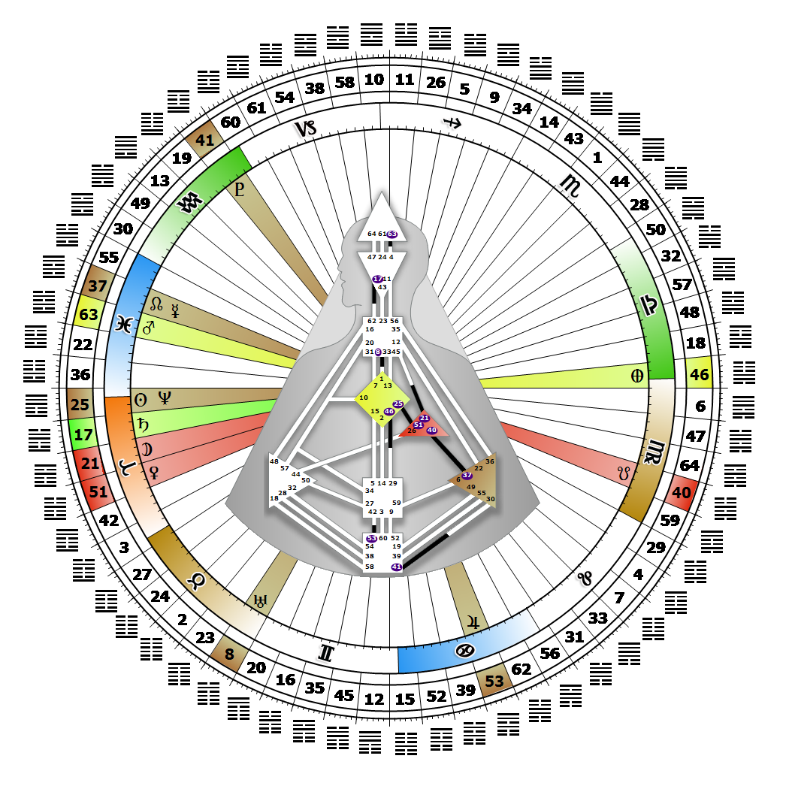

# Gate 25 - Innocence

**March 20, 2026**

## *Gate of the Spirit of the Self - The Spiritual Warrior*

> The perfection of action through uncontrived and spontaneous nature. To love everything equally. Triumph and survival enrich the spirit and result in the wonder of being.

### Right Angle Cross of the Vessel of Love | Godhead - Michael

*Quarter of Initiation,  the Realm of AlcyoneTheme: Purpose fulfilled through MindMystical Theme: The Witness Returns*

---

This Gate is part of the Channel of Initiation, A Design of Needing to be First, linking the G Center (Gate 25) to the Ego Center (Gate 51). Gate 25 is part of the Individual (Centering) Circuit with the keynote of empowerment.

The love of Gate 25 flows out of fully accepting and living surrendered to one's form. A gate of the higher self, its pivotal role is to turn people toward individuation. Our innocence is not designed to bring love into the world in any specific way, but rather to love without discrimination. Those who carry this gate hold the potential, and empower others with the potential, to love life and everything in it equally. A flower can be loved as profoundly as a human.

This quality of love is often projected as cool or cold but is neither. The mystical potential of this love is transcendent and universal, and our spirit innocence is always being tested. We have the capacity to meet these initiations from life like a spiritual warrior, fired up and ready to compete for our spirit (our individuality) no matter what the circumstance. Then, when the warrior or "fool" of Gate 51 prods us to leap into the void, or when we meet life's initiating challenges, we will be able to land on our feet and deepen our innocence into a wisdom that can empower others on their own journey. We may emerge a bit wounded from such initiations, but our ultimate triumph and survival enriches our spirit and the spirit of those around us. The result is that we are alive with the wonder, the love, of being.

---

### Line 2 - The existentialist

**☀️ Exaltation:** The perfection of the intellect through concentration and focus on what is, rather than, what could be or has been. The innocence of the Self and its protection can only be maintained in the now.

**🌑 Detriment:** A dedication that can never be free of personal motivation and its attendant projections. A lack of innocence in the now that risks protection through projection.
