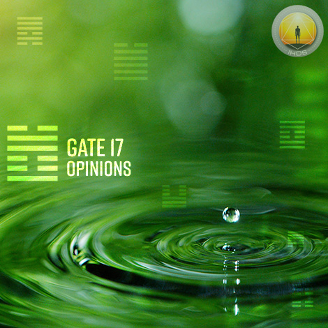
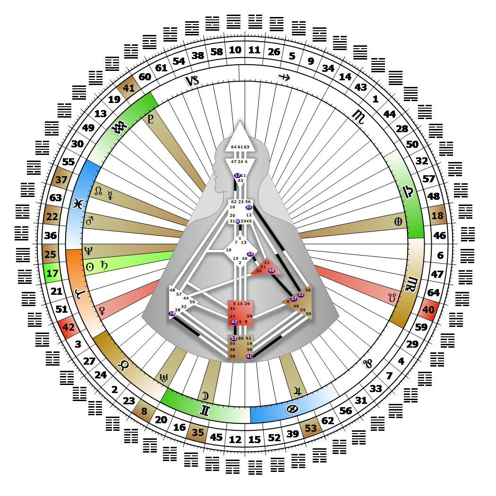

# 閘門 17 - 遵循

**2026年03月24日**

## *觀點之門 - 立足於細節*

> 古老的準則：欲統治者必先懂得如何服務。組織表達的公式。視覺上專注於模式，並將其投射至未來。

### 右角度交叉之服務 | 神性 - 麥可

*起始之季，昴宿星團之境
主題：透過心智實現目標
神秘主題：見證者歸來*

---

此閘門隸屬於「接納通道」，一種組織型存在的設計，連結邏輯中心（第17號閘門）與喉嚨中心（第62號閘門）。第17號閘門屬於集體理解（邏輯）迴路的一部分，其核心精神在於分享。

第17號閘門致力於從眾多概念或觀點中，尋找一個能讓眾人信賴的選項——這個選項必須經得起檢驗與批判，並能平息我們對未來的恐懼。此閘門的設計功能是將答案結構化為概念、可行的模式或潛在解決方案，為第62號閘門後續的細節實證鋪路。在邏輯流程的此階段之前，我們的心智已對未來產生疑慮、構思出潛在解決方案，並感受到將之表達為觀點的壓力。接下來需要的，正是第62號閘門將概念轉化為語言的能力——以事實與細節為基礎，向公眾呈現並供其檢視分析。

我們的右眼能瞬間攝取世界，將其視為可識別的視覺模式集合。若某個模式或觀點無法通過邏輯審視，就應當被摒棄。可惜的是，我們未必總能將視覺意象或對其的理解轉化為語言。若缺乏第62號閘門，我們會不斷尋找能代表概念的詞彙、支持觀點的事實，以及傳達建議的有效方式。心智焦慮往往源自於恐懼——害怕無人理解並重視我們的貢獻。

---

### 第1行 - 開放性

**☀️ 高階表達:** 維持廣泛刺激的能量。擁有眾多觀點的可能性。

**🌑 低階表達:** 傾向於限制對美學上愉悅刺激的開放性。可能將意見侷限於令人愉悅的事物。
