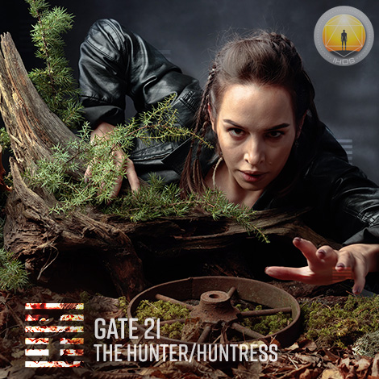
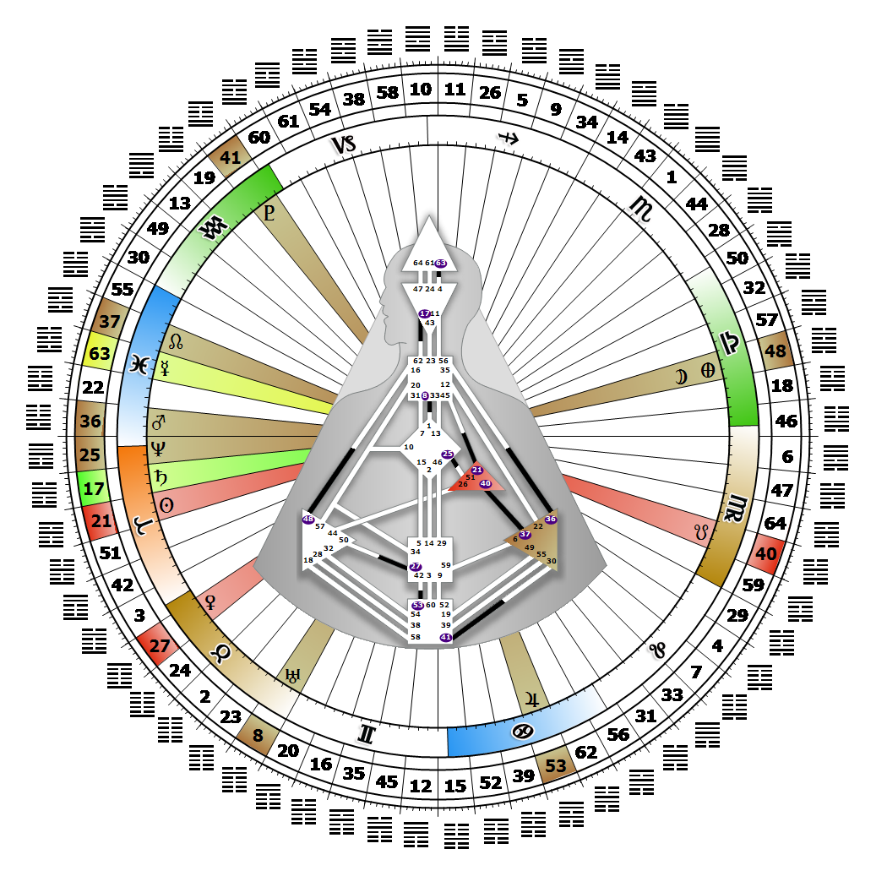

# Gate 21 - Biting Through

**April 02, 2026**

## *Gate of the Hunter/Huntress - Strength of Will*

> The justified and necessary use of power in overcoming deliberate and persistent interference. Power is fulfilled through demanding control of the environment.

### Right Angle Cross of Tension, Juxtaposition Cross of Control | Godhead - Michael

*Quarter of Initiation,  the Realm of AlcyoneTheme: Purpose fulfilled through MindMystical Theme: The Witness Returns*

---

This Gate is part of the Channel of The Money Line, A Design of a Materialist, linking the Ego Center (Gate 21) to the Throat Center (Gate 45). Gate 21 is part of the Tribal (Ego) Circuit with the keynote of support.

The 21st gate needs to be in control of its domain. In order to apply the strength and will of its ego to ensure the survival of the Tribe, it must have control over something or someone. In our modern world, this energy translates into the responsibilities given to the police, or managing director or president of a company. Biting Through is a powerful conditioning force for life on the material plane. We are successful when we can control our own material resources, where we live, what we wear, whom we work for and how we make our living.

Those who carry this gate do not like to be told what to do or to have people looking over their shoulder. On the other hand, we are destined to serve others because in a Tribal bargain all must benefit if we are to benefit ourselves. If we attempt to assume power, or to control others without following our Strategy and Authority, we will encounter forceful resistance. Regardless of the benefits of our intentions, we must wait until we are offered control. Projectors need to be with people who recognize and invite their ability to control; Generators have to be asked for access to their Sacral energy so they can respond; Manifestors have to inform before they attempt to exert control and thus measure the resistance field. Without Gate 45 we will find ourselves searching for a position from which we can oversee the future and wealth of the community.

---

### Line 4 - Strategy

**☀️ Exaltation:** Success in action through clarity. The ego to succeed on the material plane and the instinct to use will power effectively in response to conditions.

**🌑 Detriment:** A tendency, when in the right to misjudge the power of one's opponents. The drive when in the right to follow one's ego rather than one's instincts.
