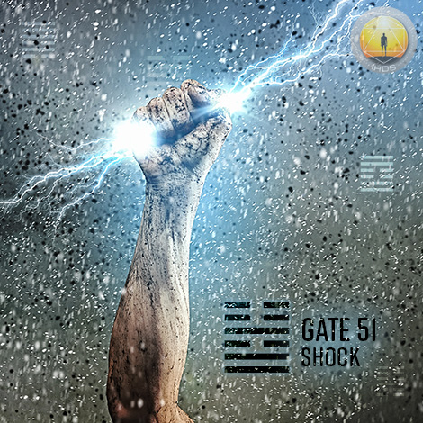
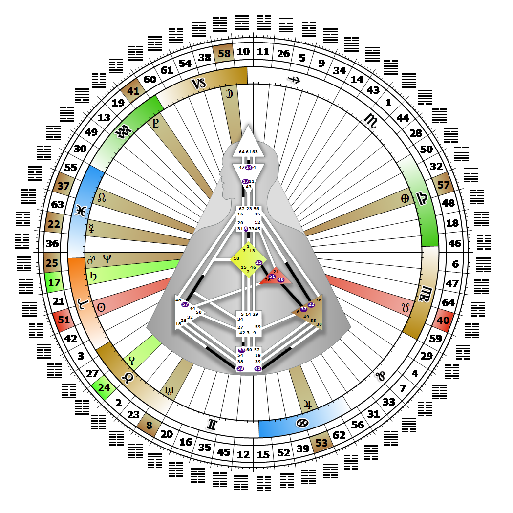

# Gate 51 - The Arousing

**April 09, 2026**

## *Gate of Shock - Arousing Empowers the Direction of Love*

> The ability to respond to disorder and shock through recognition and adaptation. The competitive power and drive to leap into the void first.

### Left Angle Cross of the Clarion | Godhead - Michael

*Quarter of Initiation,  the Realm of AlcyoneTheme: Purpose fulfilled through MindMystical Theme: The Witness Returns*

---

This Gate is part of the Channel of Initiation, A Design of Needing to be First, linking the Ego Center (Gate 51) with the G Center (Gate 25). Gate 51 is part of the Individual (Centering) Circuit with the keynote of empowerment.

Gate 51, the Gate of Shock, is the energy for Individual initiative. Backed by the ego's will and courage, it embodies the power to compete, driving us to be one step ahead of everybody, and to risk going where no one else has gone in order to find or create a place for ourselves. We are designed to withstand shock and to shock others, to move them out of the complacency of their safe cocoons and direct them toward personal transcendence and self love. Love for life itself, and the constant competition that comes with mastering the material world, arouses and empowers us. In opposition to the courage and will power that energizes us, however, is a potential for foolhardiness that endangers our vulnerable hearts, both physically and spiritually.

The secret to maintaining our heart's health is to center ourselves by attuning to our Strategy and Authority, and sense within when we have the will to engage in battle, and when we don't. This guidance will allow us to adapt to the nature of any shock or disorder confronting us, and give our heart the rest it needs in order to recuperate from our engagement with the world. Without Gate 25 we may find ourselves seeking or looking to the realm of spirit for guidance or direction.

---

### Line 5 - Symmetry

**☀️ Exaltation:** Perfected illumination that in grasping the nature of the shock, can transform its normal patterns into a symmetrical adaptation that rides the shock and avoids its devastation. The perfection of the warrior ego through instinctive adaptation.

**🌑 Detriment:** A tendency in seeking the core, to harmonize with one shock only to be overwhelmed by the next. The egoism to indulge in victory and lose vigilance.
