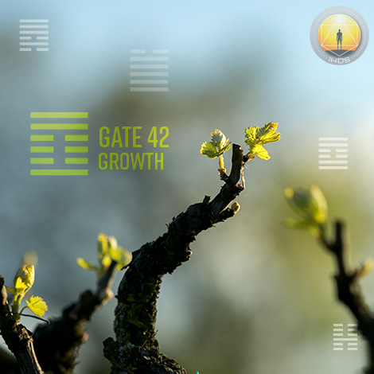
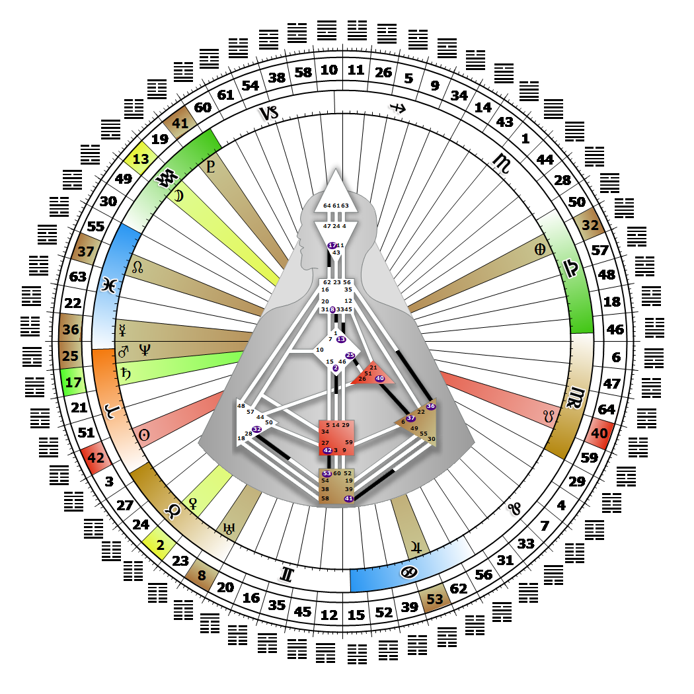

# 閘門 42 - 增長

**2026年04月12日**

## *成長之門 - 「聖杯」即是體驗*

> 擴展資源以最大化發揮完整潛能的發展。完成一個循環是成長的核心。

### 右角度交叉瑪雅 | 神性 - 傑納斯

*起始之季，昴宿星團領域
主題：透過心智實現目標
神秘主題：見證者歸來*

---

此閘門隸屬於「成熟通道」（Channel of Maturation），屬於平衡發展的設計，連結薦骨中心（Gate 42）與根部中心（Gate 53）。Gate 42 屬於集體感知（抽象）迴路的一部分，其核心精神是分享。

Gate 42 的特質是堅持完成一個循環，以最大化其內在潛能。抽象的循環過程透過運用人類累積的經驗來創造未來進步的基礎，從而促進成長與平衡發展。我們進入的每個循環，都建立在從上一個循環中學到的教訓之上。當一個循環走完其歷程，我們將決定需要什麼來為其畫下句點。在我們能開始新循環之前，必須讓前一個循環自然結束，否則未完成或未盡之事將在新循環中再次出現。這在關係中尤其明顯——我們可能因未解決的行為模式而感到卡住或受阻，這些模式甚至可追溯至童年時期。我們關注的是完成一個循環或過程所需投入的能量，而薄弱或缺乏足夠支持的開端會讓我們感到緊張與不適。

對我們而言，確認所投入之事是否正確至關重要，因為一旦我們承諾投入（例如一段不幸的婚姻），就很難從中抽身。透過等待，並依據自身策略與內在權威，在感到自在時才投入能量，我們能最大化自身的「滿足潛能」。若沒有 Gate 53 提供啟動的火花，我們可能會發現自己缺乏完成過程的持久力，或在嘗試啟動那些從未真正開始的事情時感到挫折。

---

### 第 2 行 - 識別

**☀️ 高階表達:** 識別趨勢並敏銳地把握趨勢。透過參與趨勢獲得成長的力量。

**🌑 低階表達:** 在進步變革時期，因苦行動機而退縮。因應趨勢或變化而停止成長。
