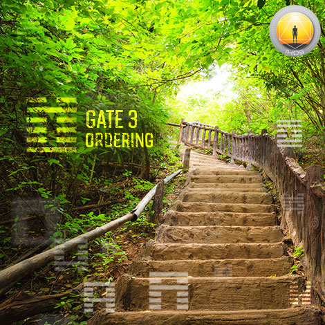
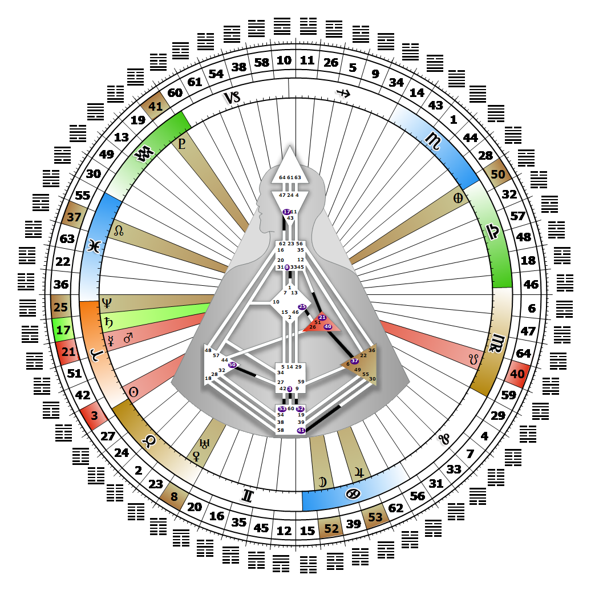

# Gate 3 - Difficulty at the Beginning

**April 22, 2026**

## *Gate of Ordering - Mutation is Generated & Empowered*

> The fundamental challenge of initiation is to transcend confusion and establish order. Individual expression that through example mutates others.

### Left Angle Cross of Wishes | Godhead - Janus

*Quarter of Initiation,  the Realm of AlcyoneTheme: Purpose fulfilled through MindMystical Theme: The Witness Returns*

---

This Gate is part of the Channel of Mutation, A Design of Energy which initiates and fluctuates - Pulse, linking the Sacral Center (Gate 3) to the Root Center (Gate 60). Gate 3 is part of the Individual (Knowing) Circuit with the keynote of empowerment.

The function of Gate 3 is to transcend confusion and establish order so that something new and potentially viable can take hold in the world. Those with this gate have a connection to unique individual knowing, personal innovation, and the potential for making a significant contribution. Waiting for the right moment for something mutative to happen can feel like forever. We will need patience to accept the occasional bursts of energy, and the unknown timing of the limited releases of potential. There is an on-off creative pulse that prevails here, and the potential for something new is neither logical nor experiential. If we don't wait for the right timing, for the structures needed for true mutation to settle into place, our enthusiasm for change will simply destabilize those around us, rather than empower and influence them.

We may experience melancholy and even depression when we feel that there is no energy fueling our potential to bring change. This is a time, however, for us to go deep into our own process, to spend time with our own creative muse. We cannot predict, control or rush the mutative moment. It has its own timing. And anyone who steps into our aura, at the right time, can be changed without us even lifting a finger.

---

### Line 6 - Surrender

**☀️ Exaltation:** As its light sustains, so life goes on. The innate acceptance that ordering is a process, not a problem.

**🌑 Detriment:** As darkness overwhelms, life can seem worthless leading to depression and the sense of hopelessness. The overwhelming power of confused energy can lead to depression.
