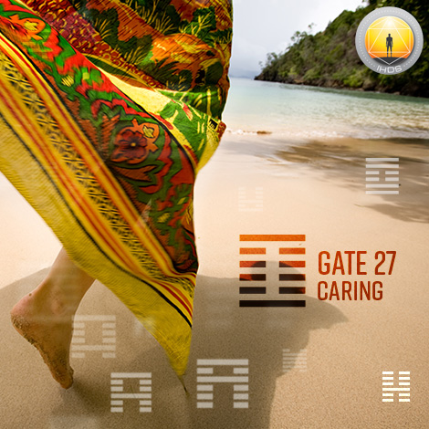
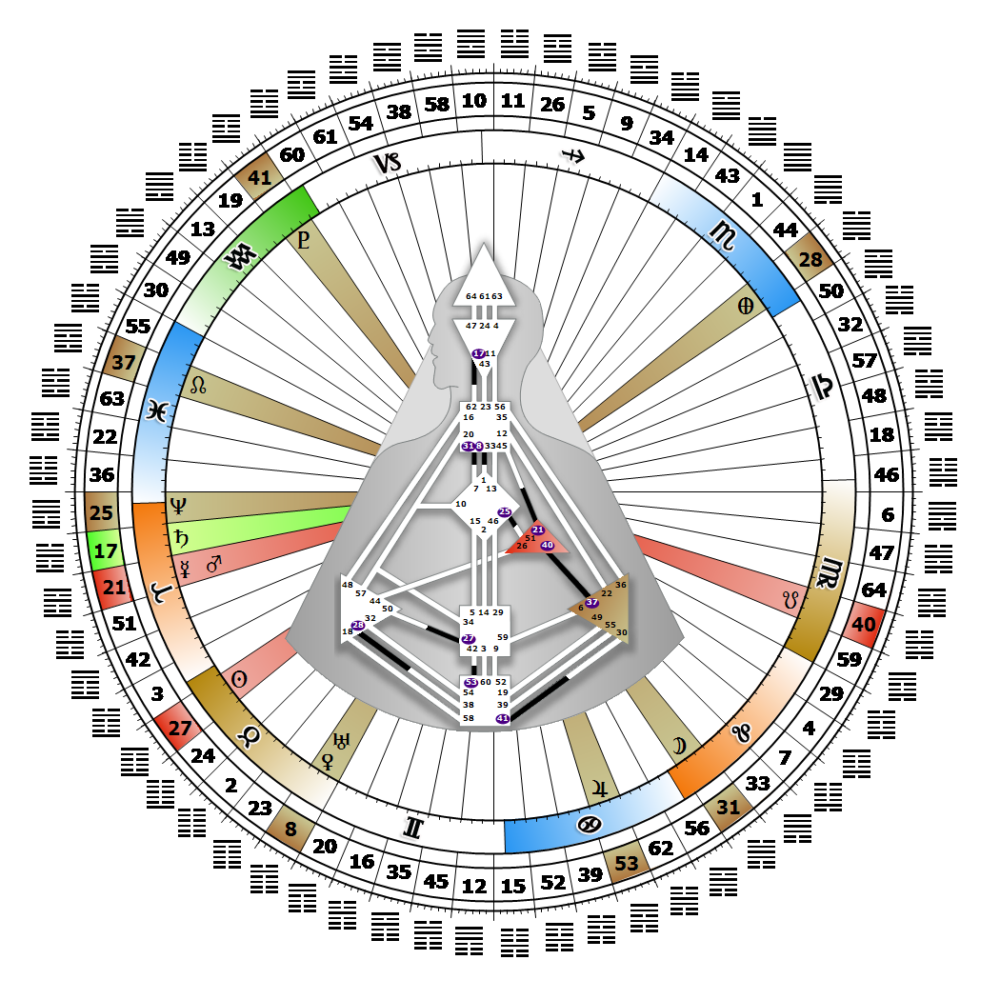

# Gate 27 - Nourishment

**April 24, 2026**

## *Gate of Caring - Care for Oneself First*

> The enhancement of the quality and the substance through caring. The compassion and the energy to care for the weak.

### Right Angle Cross of the Unexpected | Godhead - Janus

*Quarter of Initiation,  the Realm of AlcyoneTheme: Purpose fulfilled through MindMystical Theme: The Witness Returns*

---

This Gate is part of the Channel of Preservation, A Design of Custodianship, linking the Sacral Center (Gate 27) to the Splenic Center (Gate 50). Gate 27 is part of the Tribal (Defense) Circuit with the keynote of support.

The energy of the 27th gate is focused on maintaining and enhancing the quality of life through the power to care for the weak, the sick and the young. There is tremendous potential for altruism present in this gate, which we see exemplified in the life of Mother Teresa. The role of the 27th gate is to nourish and nurture through the power of compassion and care. The polarity is that we must also be nourished and nurtured ourselves. We must care for ourselves first in order to have the energy and resources to care for others, and then let our Authority guide us to where and when we commit our energy. Nourishment or nurturing given without awareness is a waste of precious resources.

Each line of this gate represents a way to connect to and care for the Tribe according to different levels of need. Without Gate 50, we may lack the instinct and values to set healthy boundaries around our natural impulse to care for others, and easily end up sacrificing ourselves or our own well-being.

---

### Line 3 - Greed

**☀️ Exaltation:** Here, the psychological manifestation. The obsession and dependency on knowing what is hidden. The secret policeman. The power derived in having more than one needs, whether sexually, mentally, or materially.

**🌑 Detriment:** Mundane and wholly without redeeming value, greed, a lust that inevitably cripples and addicts. The lust for power to get more than one needs.
