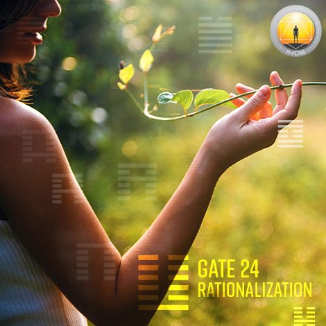
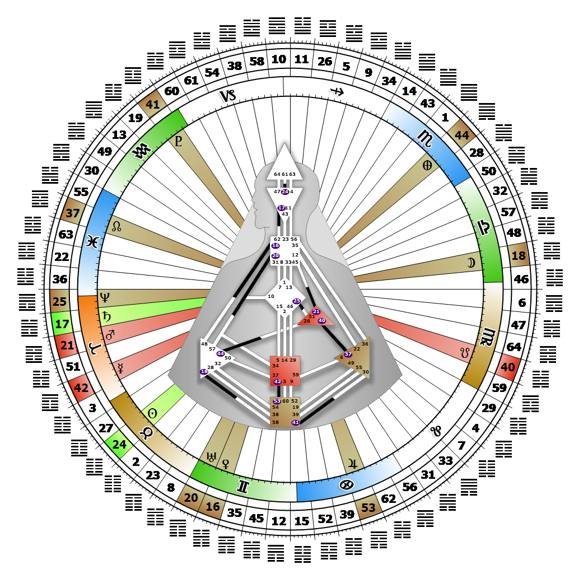

# Gate 24 - The Return

**April 29, 2026**

## *Gate of Rationalization - Inspiration Must be Given a Rational Form*

> The natural and spontaneous process of transformation and renewal. Rationalizing is a risk and a test of the Spirit. There is no proof or experience, only knowing.

### Right Angle Cross of the Four Ways | Godhead - Janus

*Quarter of Initiation,  the Realm of AlcyoneTheme: Purpose fulfilled through MindMystical Theme: The Witness Returns*

---

This Gate is part of the Channel of Awareness, A Design of the Thinker, linking the Ajna Center (Gate 24) to the Head Center (Gate 61). Gate 24 is part of the Individual (Knowing) Circuit with the keynote of empowerment.

Gate 24's function is to take the unique inspiration of Gate 61 and turn it into a rational concept which can eventually be communicated to others. It returns to the same territory over and over again, pondering a thought it considers inspiring, reviewing it until it can be brought into form. Our mind cannot act on the inspiration, however, or prove it logically or through past experience. This is a natural and spontaneous process of transformation, mental renewal and unique knowing. One moment the knowing is not there and the next moment it is. To use our individual mind to our greatest advantage, we need to give ourselves time to return and review. This process can include watching or listening to something over and over again. If we let our mind transform organically, without attempting to control it, the resolution will often appear on its own. We will hear it in a moment of silence, like those aha's that pop into our mind in the middle of the night.

Gate 24 is the fear of ignorance, which is the mental anxiety that we will never know for certain, or that we won't be able to explain our knowing. If we try and make decisions with our mind, we will trigger this anxiety. Without Gate 61 we are under pressure to make not-self mental decisions to look for the next inspiring mystery to solve.

---

### Line 2 - Recognition

**☀️ Exaltation:** The proper and spontaneous adaption to new forms. The potential gift of conceptualizing spontaneously.

**🌑 Detriment:** The vanity to see transformation as a personal achievement rather than a socially supported or natural phenomenon. The mental vanity that the gift of conceptualizing spontaneously can produce.
