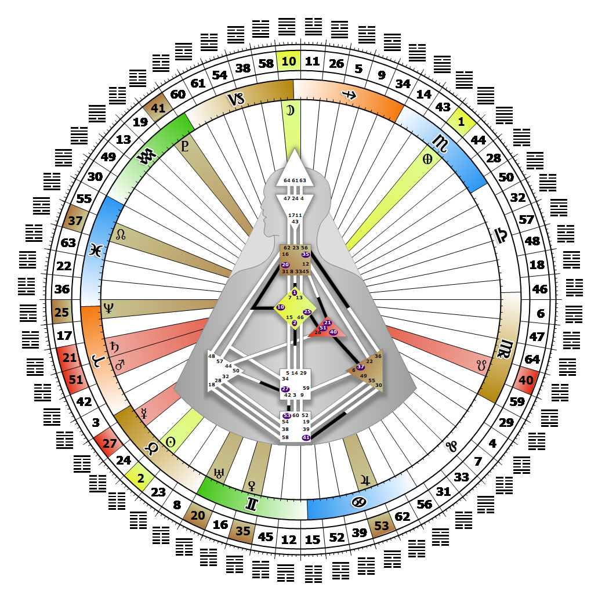

# 閘門 2 - 接納（The Receptive）

**2026年05月06日**

## *Gate of the Direction of Self - The Driver（自我方向的閘門 - 駕駛者）*

> 接納性作為決定任何回應的原始基礎，行動的根源。它讓我們困在自身分離的幻象之中。

### 右角十字斯芬克斯 2 | 神性本源 - 邁亞

*文明象限，天樞領域  
主題：透過形式達成目的  
靈性主題：從子宮到房間*

---

此閘門屬於「節奏通道」（Channel of the Beat），其設計為「鑰匙守護者」（Keeper of the Keys），連結G中心（Gate 2）與薦骨中心（Gate 14）。閘門2屬於個體（認知）迴路（Individual (Knowing) Circuit），其關鍵詞為「賦權」。

閘門2的「高層次認知」根源於自我透過磁單極（Magnetic Monopole，即驅動者）朝向愛與美的方向。驅動者專注於我們在時間中穿越空間的移動，而我們設計中內建了一種與生俱來的內在方向感，這並非單純基於地理位置。我們無法透過心智或意志改變這個方向，若他人與我們方向不同，可能就會分道揚鑣。閘門2被比喻為車輛的鑰匙，它為驅動者啟動引擎。

持續朝我們方向前進的動力與燃料，來自薦骨中心透過閘門14提供。我們甚至可能發現自己引導他人獲取支持其創意事業所需的資源，或者發現只要單純順應自身方向，就能自動賦權或確認他人自身的方向感。我們是願景家，為新的前進道路提供藍圖或全貌，但未必需要親力親為去執行或實現。我們仰賴閘門14作為盟友，獲取實現願景所需的力量與資源。

---

### 第3爻 - 耐心

**☀️ 高階表達:** 終身保持接納的奉獻，並以成熟的態度接受這個過程永無止境。透過「節奏通道」（Beat Channel）與 Gate 14（閘門14）永久連結時，將獲得服務所帶來的回報。體認到接納是一輩子的歷程。

**🌑 低階表達:** 對革命者而言，耐心是一種惡習。更高的認知無法等待，並要求立即表達。
