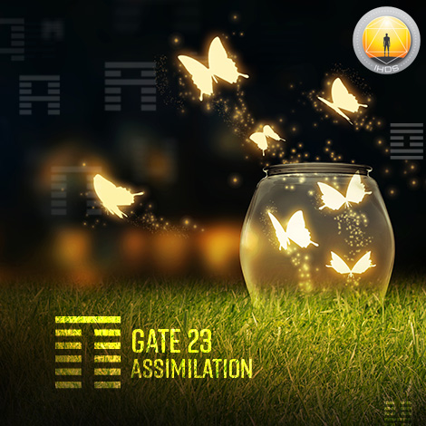
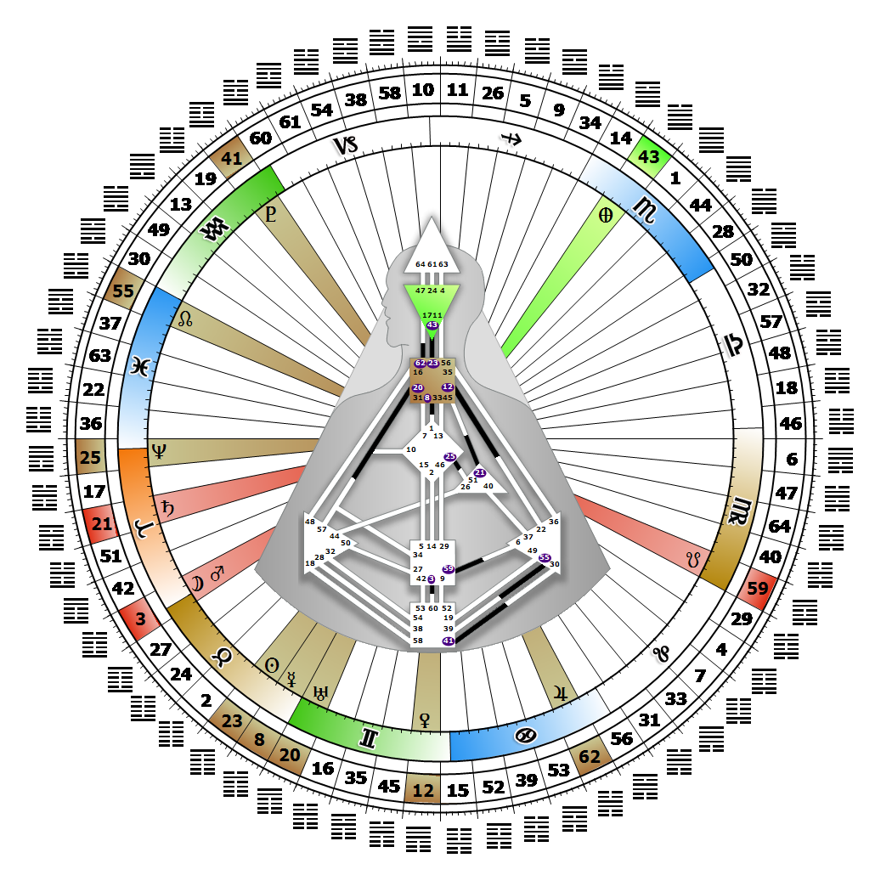

# [翻译失败] Gate 23 - Splitting Apart

**2026年05月15日**

## *[翻译失败] Gate of Assimilation - The Elimination of Intolerance*

> [翻译失败] Amorality. The awareness and understanding which leads to the acceptance of diversity. A unique insight opens the door to mutation.

### [翻译失败] Left Angle Cross of Dedication | Godhead - Maia

*[翻译失败] Quarter of Civilization,  the Realm of DubheTheme: Purpose fulfilled through FormMystical Theme: Womb to Room*

---

[翻译失败] This Gate is part of the Channel of Structuring, The Design of Individuality (Genius to Freak), linking the Throat Center (Gate 23) to the Ajna Center (Gate 43). Gate 23 is part of the Individual (Knowing) Circuit with the keynote of empowerment.

Gate 23 is where inspiration as inner knowing is finally translated into language. Its amorality, acceptance of diversity, and ability to cut through mental intolerance opens the way for mutation to take hold in the world. Expression through the Gate of Assimilation initiates us into new ways of thinking. Gate 23's unique voice can finally say, "I know." What we know, or don't know, will always attract the attention of others, but can also keep us on the outside looking in. Insights that are potentially different and transformative require that we communicate their essence clearly. If our unique perspective is truly to be of value to others, we must wait for the right timing to speak, and explain it in a simple and accessible way. If we don't, we will be dismissed as a freak.

It is also important that we speak only what we truly know. Over time, our genius will be recognized and we will earn the respect of others. Without Gate 43's conceptualizing, we may experience mental anxiety as we realize that we don't know exactly what it is we know, leaving ourselves open to misunderstanding and dismissal.

---

### [翻译失败] Line 6 - Fusion

**☀️ 高階表達:** [翻译失败] The exponential growth of energy and its power of assertion engendered by fusion. Individual knowing which brings diversity to synthesis.

**🌑 低階表達:** [翻译失败] The principled but futile withdrawal from fusion that leads to atrophy. Individual knowing that holds on to diversity and loses its power in expression.
