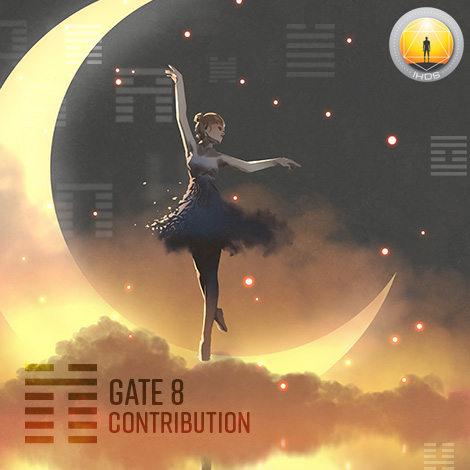
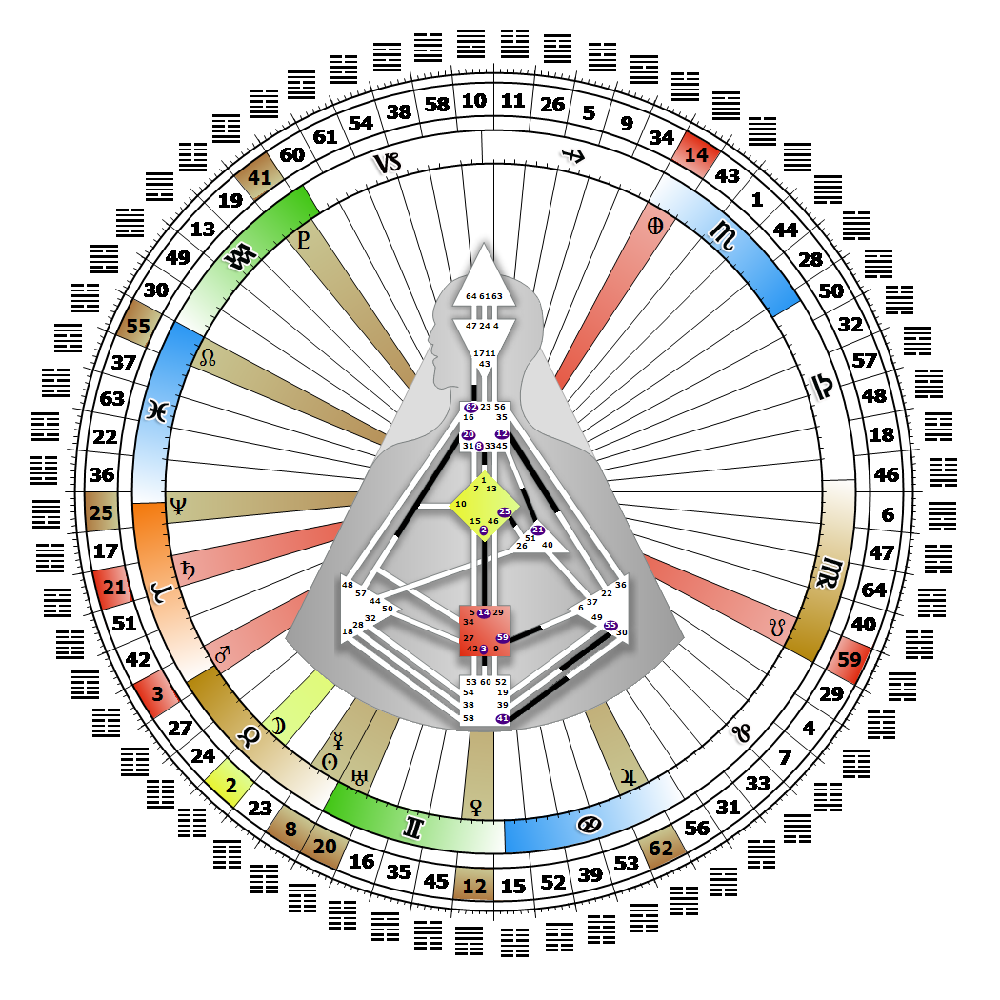

# Gate 8 - Holding Together

**May 16, 2026**

## *Gate of Contribution - Leading by Example*

> The basic worth realized in contributing individual efforts to group goals. Through example, the contribution of the individual is impressed on the collective.

### Right Angle Cross of Contagion 2 | Godhead - Maia

*Quarter of Civilization,  the Realm of DubheTheme: Purpose fulfilled through FormMystical Theme: Womb to Room*

---

This Gate is part of the Channel of Inspiration, The Creative Role Model, linking the Throat Center (Gate 8) to the G Center (Gate 1). Gate 8 is part of the Individual (Knowing) Circuit with the keynote of empowerment.

Gate 8 says, "I know I can contribute, or not." Our contribution will come either through a public display of our own Individual lifestyle, direction and creations, or by empowering and publicly promoting others. Those who carry this gate are drawn toward what is novel and innovative, and will find themselves attracting other people's attention to it, like the Gallery owner or art agent. Once we get people's attention, all we can do is lead by example. If others wish to follow, they will. This is how we quietly impact the Collective and shift the Tribe's orientation over time. Unless Individuality's innovative contributions are embraced and incorporated in some way by the Collective and the Tribe, they will not take hold.

The leadership path of recognizing and displaying what is mutative and unique can be a lonely one as we must first be recognized, and then invited to publicly display and endorse what we know to be of future value. Without the invitation, society's attention may be negative. If Gate 1's creative means of self-expression is not defined in our chart, we will seek its inspirational qualities; however, our key role is not as the artist but as the agent who promotes other artists' vision of the new.

---

### Line 1 - Honesty

**☀️ Exaltation:** The awareness that the whole is always greater than the sum of its parts. Knowing that creative expression must be honestly communicated and shared.

**🌑 Detriment:** Withdrawal. The fear of losing individuality in a group environment. The design to share creativity at the expense of individuality.
