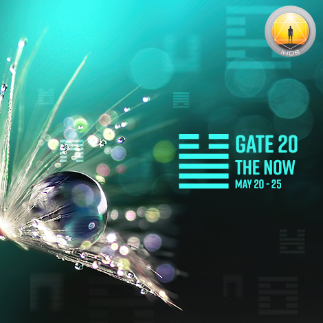
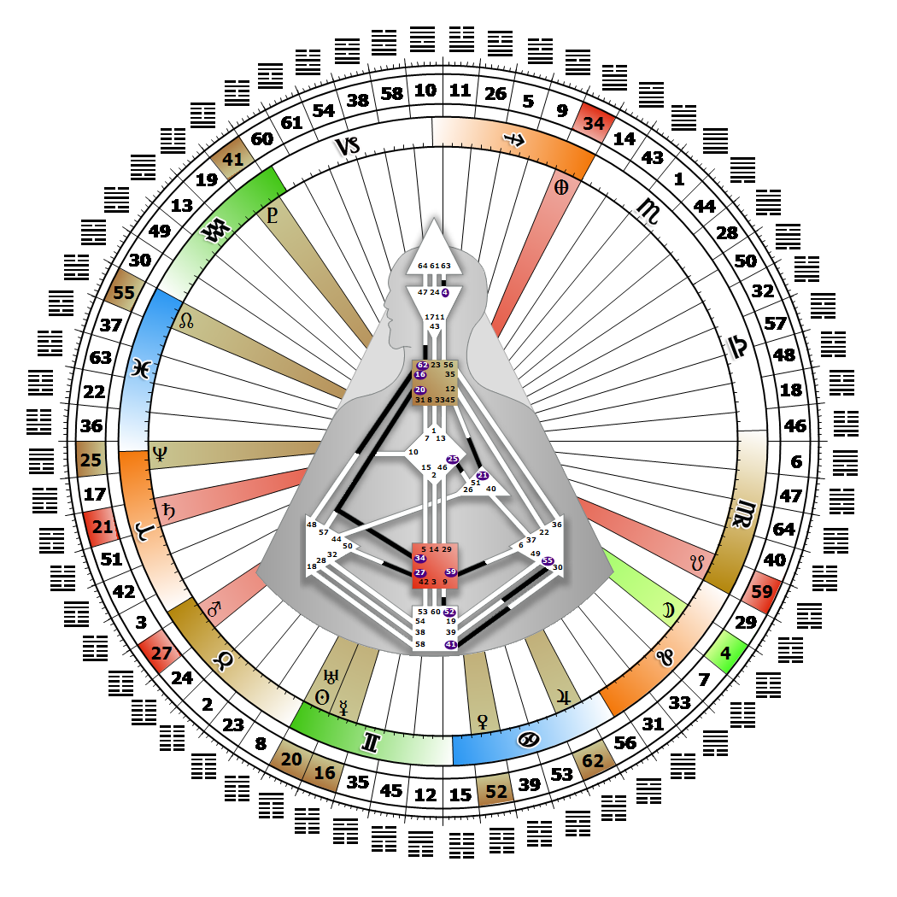

# [翻译失败] Gate 20 - Contemplation

**2026年05月22日**

## *[翻译失败] Gate of The Now - I Am Now*

> [翻译失败] Recognition and awareness in the now which transforms understanding into right action. Contemplation is purely existential.

### [翻译失败] Right Angle Cross of the Sleeping Phoenix 2 | Godhead - Maia

*[翻译失败] Quarter of Civilization,  the Realm of DubheTheme: Purpose fulfilled through FormMystical Theme: Womb to Room*

---

[翻译失败] This Gate is part of the Channel of Awakening, A Design of Commitment to Higher Principles, linking the Throat Center (Gate 20) to the G Center (Gate 10). Gate 20 is part of the Integration Channel with the keynote of self-empowerment. This Gate is a part of the Channel of The Brain Wave, A Design of Awareness, linking the Throat Center (Gate 20) to the Splenic Center (Gate 57). Gate 20 is part of the Individual (Knowing) Circuit with the keynote of empowerment. This Gate is part of the Channel of Charisma, A Design where Thoughts Must Be Deeds, linking the Throat Center (Gate 20) to the Sacral Center (Gate 34). Gate 20 is part of the Integration Channel with the keynote of self-empowerment.

Gate 20 is a purely existential gate that keeps us focused in the present, and supports our capacity to survive as ourselves. When our expression is properly timed, awareness will be transformed into words or actions that can impact people around us. This energy frequency is, and must be, totally absorbed in the present moment. It can give voice to Gate 57's intuitive survival awareness, to Gate 10's behavioral patterns and commitments to higher principles, or it can manifest Gate 34's sacral power through action toward individuation. Gate 20 expresses the full range of being in the moment from "I am now" to "I know I am myself doing now," but it does not consider the past or the future.

To be awake and aware, and to survive, we must be fully present to the moment and authentically ourselves. There is rarely time to mentally consider or control what comes bubbling up from inside of us, so what we say or what we do is suddenly there for everybody, including us, to witness. In fact, we often see when we are not looking, or hear when we are not listening. This is how the potential for evolutionary change hidden in each moment of existence is empowered within us. As we live by our Strategy and Authority, we become a living example. Our intuitive knowing, personal survival and mutative, self-loving behaviors influence or empower others.

---

### [翻译失败] Line 2 - The dogmatist

**☀️ 高階表達:** [翻译失败] The limitation if personal and exclusive is less negative through ascetic withdrawal. A restrictive awareness of the now.

**🌑 低階表達:** [翻译失败] The power to lead others down a narrow path. The gift through expression of leading others down a narrow and restrictive path.
