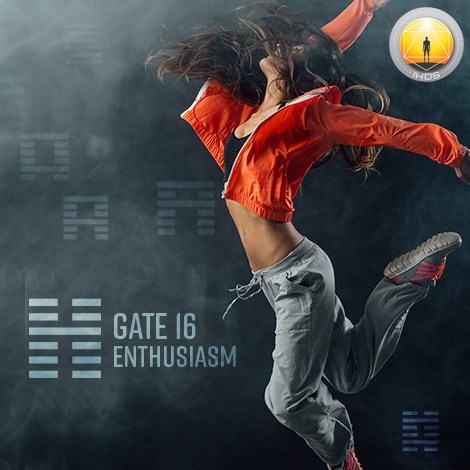
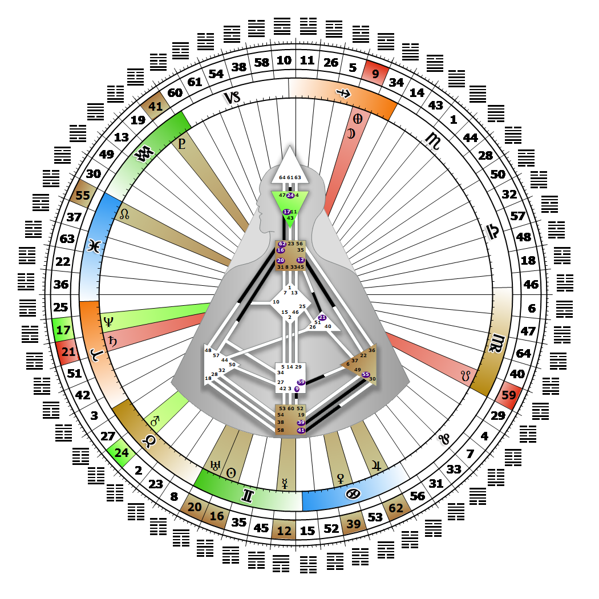

# Gate 16 - Enthusiasm

**May 31, 2026**

## *Gate of Skills - The Skills for Living - Life as Art*

> The great art of enriching life by the harmonic channeling of energy. Experimentation to find the 'Perfect' skillful expression.

### Left Angle Cross of Identification | Godhead - Lakshmi

*Quarter of Civilization,  the Realm of DubheTheme: Purpose fulfilled through FormMystical Theme: Womb to Room*

---

This Gate is part of the Channel of The Wave Length, A Design of Talent, linking the Throat Center (Gate 16) to the Splenic Center (Gate 48). Gate 16 is part of the Collective Understanding (Logic) Circuit with the keynote of sharing.

With Gate 16 we eventually make our mark in the world as a keen critic, skilled performer, or through our talent and enthusiasm for living. We don't, however, begin life that way. We need to identify with a skill or skills, dedicate ourselves to repetition of the pattern, and focus on practice until we reach a point of mastery that transcends the skill itself and becomes an art. The world waits for that moment when the dancer becomes the dance, or when living one's life becomes its own masterpiece. We are looking for the perfect way to express our expertise. Without Gate 48 however, we may become self-critical and feel that we don't have the adequate depth.

We are also searching for a source of material support that will allow us to concentrate on perfecting our talent, our theory, our solution, so we can then make it available to the world. We look to people with Gate 48 to bring their depth and dimension to our skill, as well as to properly direct, correct and encourage our own disciplined practice.

---

### Line 5 - The grinch

**☀️ Exaltation:** The power to avoid enthusiasm for the sole purpose of being converted. As with Dickens' Scrooge, eventual conversion leads to greater and more enduring enthusiasm. A lack of confidence in the expression of skills that needs the encouragement of others.

**🌑 Detriment:** Why should I be happy when ... etc. A lack of confidence in the value of encouraging others.
