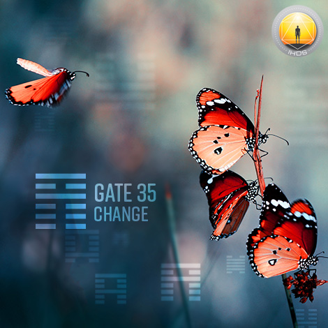
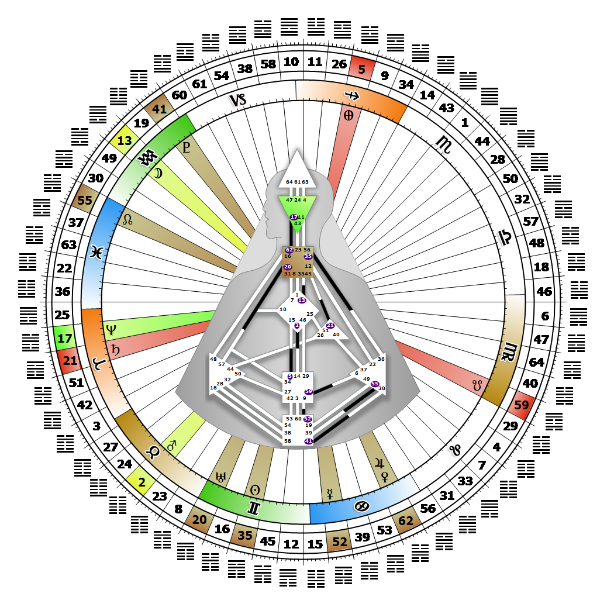

# [翻译失败] Gate 35 - Progress

**2026年06月06日**

## *[翻译失败] Gate of Change - The Secret is 'No-Expectation'*

> [翻译失败] By design, progress can not exist in a vacuum and is dependent on interaction. Life is a continuous cycle of experiences with beginnings, middles, and ends.

### [翻译失败] Left Angle Cross of Separation | Godhead - Lakshmi

*[翻译失败] Quarter of Civilization,  the Realm of DubheTheme: Purpose fulfilled through FormMystical Theme: Womb to Room*

---

[翻译失败] This Gate is part of the Channel of Transitoriness, A Design of a 'Jack of All Trades', linking the Throat Center (Gate 35) to the Solar Plexus Center (Gate 36). Gate 35 is part of the Collective Sensing (Abstract) Circuit with the keynote of sharing.

Gate 35 is driven by a restless curiosity and high expectations to explore new horizons for the sheer exhilaration of doing it, but not alone. Gate 35's voice says, "I feel," and what it usually feels is a desire for change. This is the voice of impersonal, relational experience. We are prodded along not by awareness, but by a hunger for depth of feeling that is conditioned by the emotional wave. Like hunger, desire and curiosity can only be temporarily ameliorated. We are focused on collecting experiences to learn from them, rather than on repeating experiences to master them. Mastery is expressed as wisdom and manifests as advice.

Our memories may provide more satisfaction than the experience itself. Our taste for new experience, and the need to see what or who is on the other side of the mountain, can keep us healthy and alert. When correctly entering into experience for its own sake, and remaining an objective observer, our clear sharing carries the potential to transform humanity. Experience seekers don't often take time to consider the repercussions of their actions, and without Gate 36, we are prone to seeking an emotional rush in the hope of escaping the pain of boredom when there is no new experience to dive into.

---

### [翻译失败] Line 5 - Altruism

**☀️ 高階表達:** [翻译失败] The principles of interaction and harmony communicated successfully for the benefit of the whole. Progressive communication that can bring beneficial change to the whole.

**🌑 低階表達:** [翻译失败] Jupiter in detriment, though altruistic and cooperative in general, a personal regret that in interaction a greater personal expansion had been lost. Progressive communication, but always the sense that personal progress has been sacrificed.
