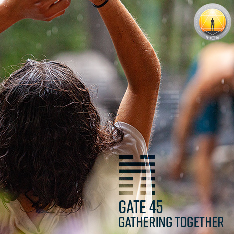
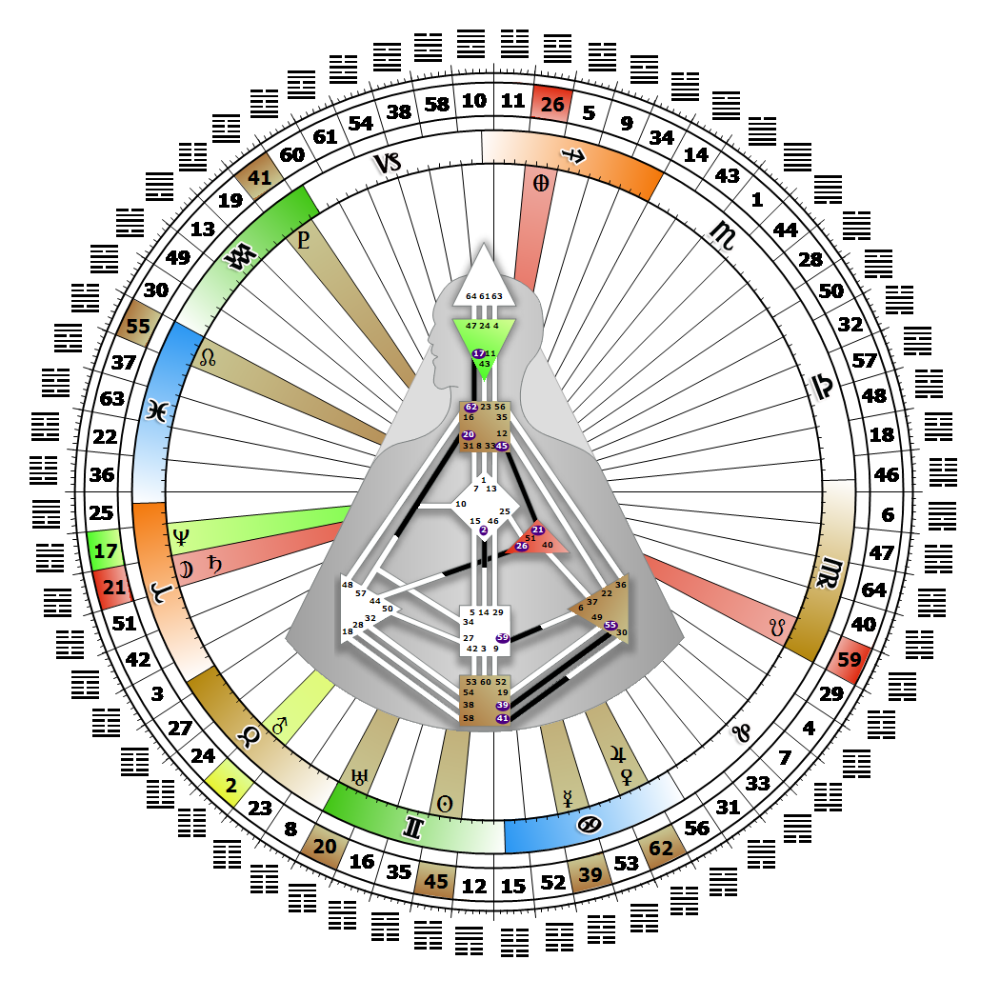

# [翻译失败] Gate 45 - Gathering Together

**2026年06月10日**

## *[翻译失败] Gate of the Gatherer - The Ruler*

> [翻译失败] The natural and generally beneficial attraction of like forces. Generosity is the key to harmony in the community.

### [翻译失败] Right Angle Cross of Rulership 2 | Godhead - Lakshmi

*[翻译失败] Quarter of Civilization,  the Realm of DubheTheme: Purpose fulfilled through FormMystical Theme: Womb to Room*

---

[翻译失败] This Gate is part of the Channel of The Money Line, A Design of a Materialist, linking the Throat Center (Gate 45) to the Ego Center (Gate 21). Gate 45 is part of the Tribal (Ego) Circuit with the keynote of support.

Gate 45 is the gate of dominance. It is the gate of the Master/Mistress or King/Queen. It is the single voice of the Tribe, "I have," and a deeply possessive gate of manifestation and action. The Gate of the Gatherer is here to protect the Tribe's material resources. We are a natural authority and guide for the Tribe; however, we are not really here to work. When what we 'have' is used on behalf of those we protect, there is peace in our kingdom. We have an ability to gather people together to manifest what the tribe needs to expand the community and to bring harmony to those around us, although Gate 21 handles the actual management of the Tribe's business. We own the land, but we must give Gate 21 permission to hunt on it, while still demanding that we receive the best piece of meat in the bargain. When we attempt to tell Gate 21 how to run our kingdom, or when Gate 21 tries to get the best piece of meat for itself, there is tension.

Each gate has its specific role and purpose within the Tribe, and operates optimally when kept in its place. Even with Gate 21 in our own design, it works best for us to have the help of another Gate 21 to manage and run our kingdom or business.

---

### [翻译失败] Line 3 - Exclusion

**☀️ 高階表達:** [翻译失败] The ability when excluded to take whatever measures are necessary to dissolve the antiquated form and to accept even humiliation to achieve inclusion. The instinct to find a way to be included in a material process.

**🌑 低階表達:** [翻译失败] An aggressive and often violent reaction to exclusion. The expression of frustration when not included in a material process.
