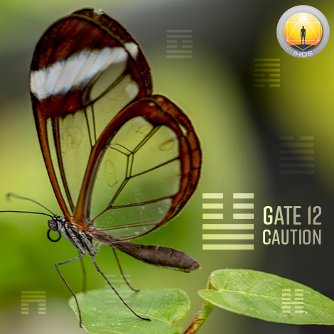
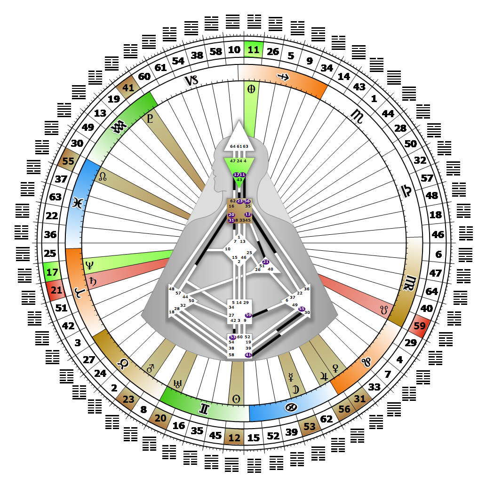

# [翻译失败] Gate 12 - Standstill

**2026年06月16日**

## *[翻译失败] Gate of Caution - Releasing Awareness in the Proper Spirit*

> [翻译失败] The quality of restraint and the importance of meditation and inaction in confronting temptation. The power of cultural mutation is the mystery of Standstill.

### [翻译失败] Right Angle Cross of Eden 2 | Godhead - Lakshmi

*[翻译失败] Quarter of Civilization,  the Realm of DubheTheme: Purpose fulfilled through FormMystical Theme: Womb to Room*

---

[翻译失败] This Gate is part of the Channel of Openness, The Design of the Social Being, linking the Throat Center (Gate 12) to the Solar Plexus Center (Gate 22). Gate 12 is part of the Individual (Knowing) Circuit with the keynote of empowerment.

The articulate, mutative and moody voice of the Individual is restrained in Gate 12 by a natural caution. This caution keeps us silent until our mood tells us that we really do have something to say, as well as a unique, transformative way of saying it. The vocal vibration or tone of our voice speaks louder than our choice of words.

Standing still, or contemplating a unique perception or feeling until in the mood to express it in a creative way, through poetry or music for instance, gives our message time to mature. Those who carry this gate have their greatest impact on others as a "stranger of consequence;" like a performer, they translate and creatively express the joys and sorrows of loving and living, and then withdraw. When we are not in the mood, chances are our audience won't hear what we want them to, or will not experience the transformation or inspiration that interacting with us can bring. Impeccable timing maximizes the potential impact we can have on social/cultural norms, and on our way of being with each other in the world. We know how to express ourselves, but without the 22nd gate we can't always clarify what it is we are feeling.

---

### [翻译失败] Line 4 - The prophet

**☀️ 高階表達:** [翻译失败] The rousing of the stagnant for communal preparation. The ability to foresee and express the need for social interaction and an end to caution.

**🌑 低階表達:** [翻译失败] The voice in the wilderness. The expressed need for social interaction that falls on deaf ears.
