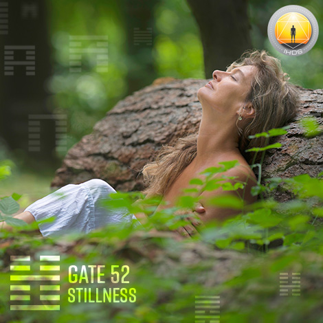
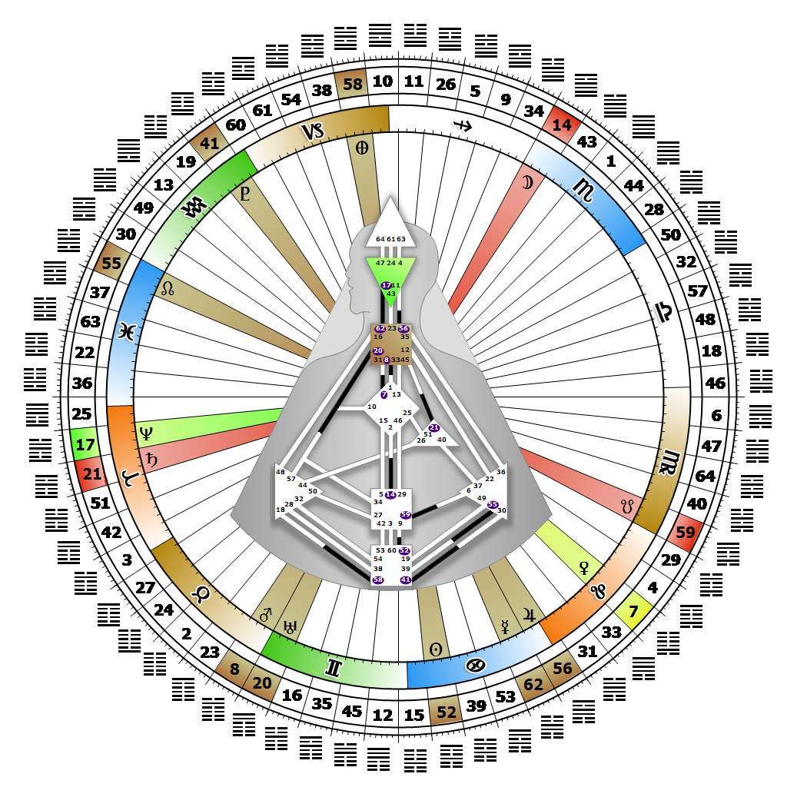

# [翻译失败] Gate 52 - Keeping Still (Mountain)

**2026年06月26日**

## *[翻译失败] Gate of Stillness - Focused and Channeled Energy*

> [翻译失败] Temporary and self-imposed inaction for the benefit of assessment. Concentration benefits from stillness and withdrawal. A passive rather than active energy.

### [翻译失败] Right Angle Cross of Service 2 | Godhead - Parvati

*[翻译失败] Quarter of Civilization,  the Realm of DubheTheme: Purpose fulfilled through FormMystical Theme: Womb to Room*

---

[翻译失败] This Gate is part of the Channel of Concentration, A Design of Determination, linking the Root (Gate 52) to the Sacral Center (Gate 9). Gate 52 is part of the Collective Understanding Circuit (Logic) with the keynote of sharing.

Gate 52 is energy under pressure that is focused on assessment, the raw power to concentrate. There is a passive tension in this connection from the Root Center that is looking toward Gate 9 for an outlet. Once the 52nd gate finds something it deeply identifies with, something worthwhile to channel this energy toward, the tension is balanced between the Root Center's pressure to keep us moving forward, and Gate 52's power to help us sit still and concentrate. Before this balance is reached, however, we can find ourselves vacillating between restlessness and depression, bouncing from one thing to the next, unable to find the self discipline to withdraw once again into our stillness and concentrate.

There is no physical outlet within Gate 52 that can direct or relieve this passive tension within us except to focus it. Without Gate 9, it is difficult to know what activity or details to concentrate it on.

---

### [翻译失败] Line 2 - Concern

**☀️ 高階表達:** [翻译失败] The pause that is initiated to benefit others. The pressure to restrain energy for the benefit of others.

**🌑 低階表達:** [翻译失败] A selfish and abrupt pause that may endanger others unnecessarily. The pressure to selfishly restrain energy at the expense of others.
