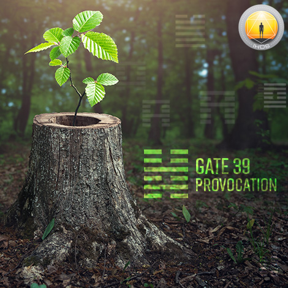
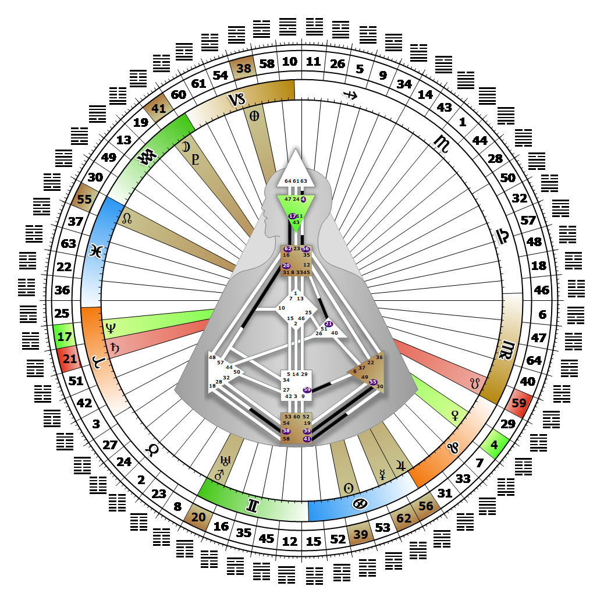

# [翻译失败] Gate 39 - Obstruction

**2026年07月02日**

## *[翻译失败] Gate of Provocation - The Journey is Toward Spirit*

> [翻译失败] The value of obstruction in provoking analysis, assessment and reevaluation. Provoking brings the spirit of emotional awareness into expression.

### [翻译失败] Right Angle Cross of Tension 2 | Godhead - Parvati

*[翻译失败] Quarter of Civilization,  the Realm of DubheTheme: Purpose fulfilled through FormMystical Theme: Womb to Room*

---

[翻译失败] This Gate is part of the Channel of Emoting, A Design of Moodiness, linking the Root Center (Gate 39) to the Solar Plexus Center (Gate 55). Gate 39 is part of the Individual (Knowing) Circuit with the keynote of empowerment.

Gate 39, fueled by the Root Center, is the pressure to provoke the evolving emotional awareness of spirit into revealing itself. Emotional awareness is humanity's destiny, but it is the Individual through the 39th gate that provokes the mutative potential within the 55th gate to release the spirit consciousness of the Solar Plexus Center. We have the energy to persevere through our moods and tap into spirit awareness. Our provoking reveals whose spirit is correct for us. If we are merely a source of irritation to them, they are not right for us. People may react negatively to our provocation, but this is our unique gift, even though we may have to develop a thick skin to live with it.

Provoking is also the way we get in touch with and work out our own feelings; if we are in bad mood, we may elicit misery from others. It takes time to learn who can be successfully provoked or not, and we can only impact the Collective or the Tribe and release true mutation, when in the right spirit or mood ourselves. This is what makes mutation contagious and moves the potential for awareness through the totality. The 39th gate is one of three gates of deafness, meaning we are not designed to be easily influenced. Without the 55th gate's ability to release emotions, Root Center pressure may provoke us into excesses, like substance abuse or an eating disorder. Patience with ourselves and our emotions is required for our journey toward spirit.

---

### [翻译失败] Line 1 - Disengagement

**☀️ 高階表達:** [翻译失败] The determination when confronted by obstacles to withdraw but only temporarily. The energy to provoke by refusing to confront obstacles.

**🌑 低階表達:** [翻译失败] Disengagement, with an accompanying indecision as to when to reengage. The refusal to confront obstacles without the capacity to know when to engage. The indecision is also a provocation.
