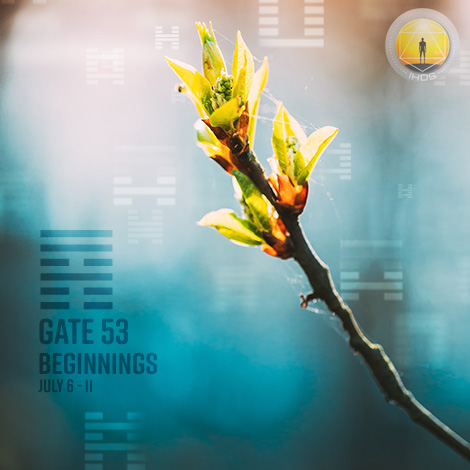
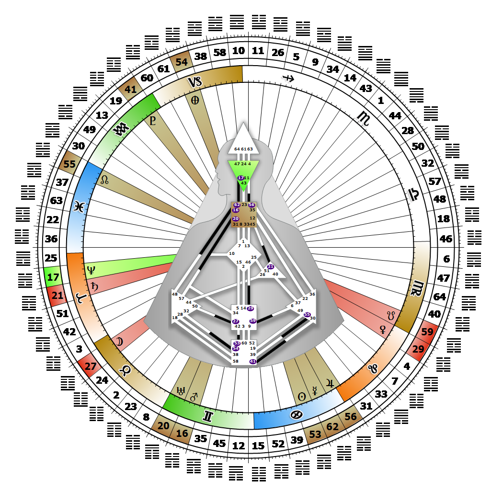

# Gate 53 - Development

**July 09, 2026**

## *Gate of Beginnings - Transition and Change*

> Development as a structured progression that is both steadfast and enduring. The intensity to start something one moment will fall away in the next. Wait for clarity.

### Right Angle Cross of Penetration 2 | Godhead - Parvati

*Quarter of Civilization,  the Realm of DubheTheme: Purpose fulfilled through FormMystical Theme: Womb to Room*

---

This Gate is part of the Channel of Maturation, A Design of Balanced Development, linking the Root Center (Gate 53) to the Sacral Center (Gate 42). Gate 53 is part of the Collective Sensing (Abstract) Circuit with the keynote of sharing.

Gate 53 is the pressure to begin the cyclical process of maturation, a sequence of development from conception to completion. This is a format energy that applies to all life forms as well as to relationships, ideas, projects, trends, and even the life cycles of nations and civilizations. We carry the fuel needed to begin something new. If we give ourselves time to correctly decide where to commit our energy, we will initiate the cycle whose time has come, and we will be able to see it flower and ripen, and leave its seed for the future. Our role is to provide the impetus to get the cycle moving. Follow our Strategy and Authority in order to avoid beginning projects or relationships that we are not equipped to or interested in finishing ourselves, or that we are unable to pass on to someone who can bring what we started to completion.

If our beginnings continually meet resistance, or are stopped before they mature, our disappointment can cycle into depression. If we commit to beginning something correctly, we are not compelled to complete it ourselves. We will find that we can appropriately discharge the pressure, take what we learned from the experience, and enjoy sharing that wisdom with others. Without Gate 42, we are not designed to finish everything we begin, but we can feel frustrated by thinking that we always have to.

---

### Line 2 - Momentum

**☀️ Exaltation:** The protection of early success nurtures further achievement. The pressure to start something new based on past success.

**🌑 Detriment:** A tendency with early success to haste and imprudent action. The pressure based on success to be impatient for something new.
