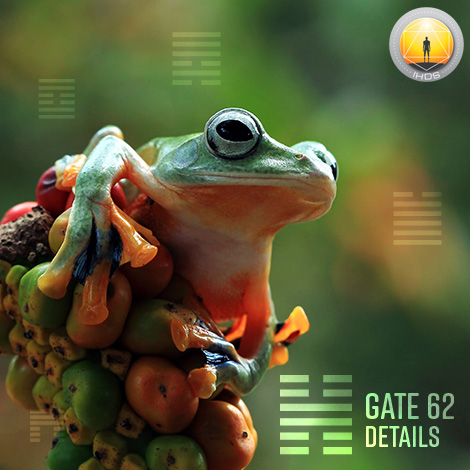
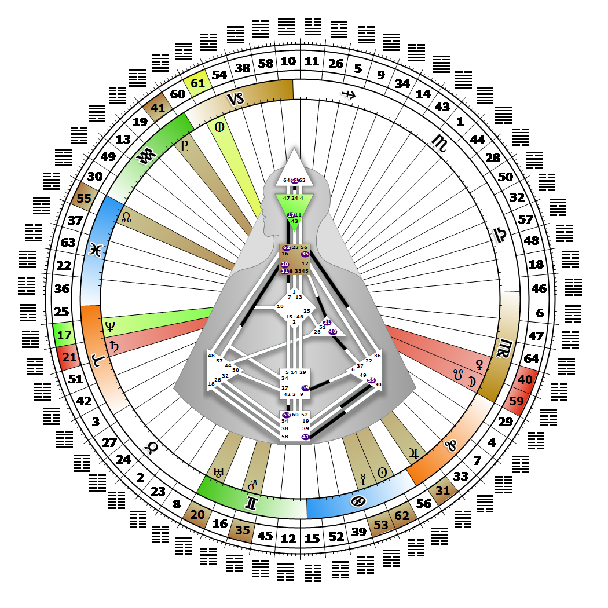

# [翻译失败] Gate 62 - Preponderance of the Small

**2026年07月17日**

## *[翻译失败] Gate of Details - Manifestation Through Detail*

> [翻译失败] Caution, patience and detail produce excellence out of limitation. The fixing of names is the foundation of the Maia and for sharing the Human experience.

### [翻译失败] Left Angle Cross of Obscuration | Godhead - Maat

*[翻译失败] Quarter of Civilization,  the Realm of DubheTheme: Purpose fulfilled through FormMystical Theme: Womb to Room*

---

[翻译失败] This Gate is part of the Channel of Acceptance, A Design of An Organizational Being, linking The Throat Center (Gate 62) with the Ajna (Gate 17). Gate 62 is part of the Collective Understanding (Logic) Circuit with the keynote of sharing.

Gate 62 says, "I think." It is designed to name, concretize, and communicate a visual pattern. It selects and organizes details as facts in order to better understand and explain complex concepts or situations. When connected to Gate 17's ability to structure the concept, Gate 62's supportive details make these concepts tangible, meaningful and understandable so they can be repeated and tested over time. Understanding is logic's gift - and ours. When we address complicated situations with clear, appropriate and well-organized details, our opinions increase our understanding of the world.

When we wait to be asked to speak, we increase the Collective's potential receptivity to what we are sharing, and we avoid the embarrassment of compulsively blurting out facts and details that are unwanted, unnecessary and may potentially obscure people's understanding. The quality of our opinion is always dependent on our grasp of the facts, but all facts are not equal. It is helpful to remember that we can have all the details in hand, but without Gate 17 may not necessarily be able to put them into their proper structural context for expression in the moment.

---

### [翻译失败] Line 5 - Metamorphosis

**☀️ 高階表達:** [翻译失败] The reaching out to others to share, symbolized by the Moon's phases as it moves from darkness to eventually sharing fully its light. The understanding that only when the details are complete can action or expression be initiated.

**🌑 低階表達:** [翻译失败] A tendency in metamorphosis to seek acclaim through dramatic presentation. When the details are organized, the need for attention demands expression.
