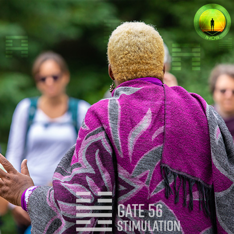
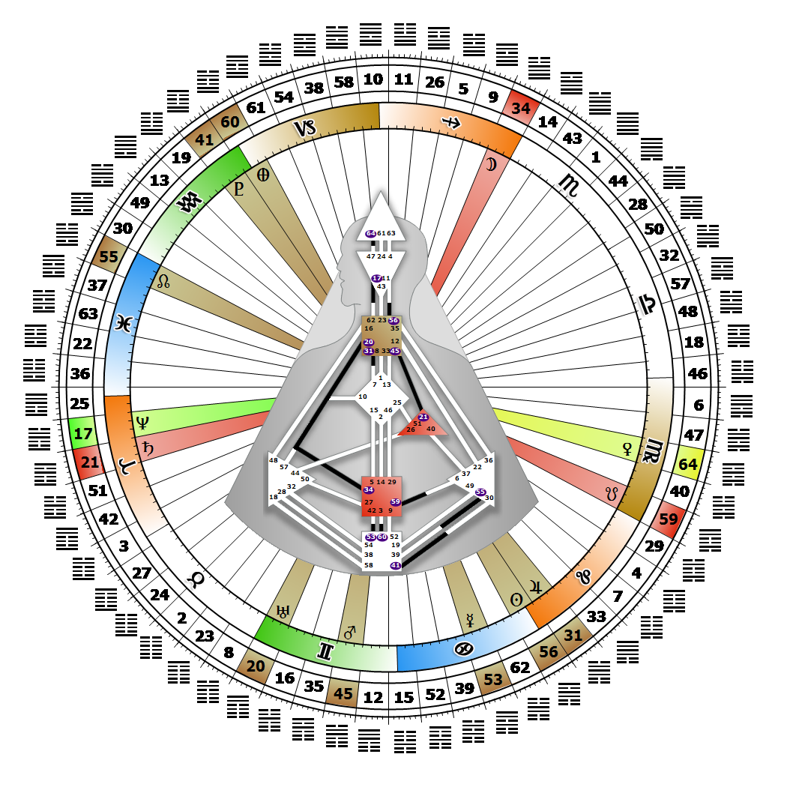

# Gate 56 - The Wanderer

**July 24, 2026**

## *Gate of Stimulation - The Storyteller*

> Stability through movement. Perpetuation of continuity through the linking of short term activity. The idea is never a solution but is always a journey.

### Left Angle Cross of Distraction | Godhead - Maat

*Quarter of Civilization,  the Realm of DubheTheme: Purpose fulfilled through FormMystical Theme: Womb to Room*

---

This Gate is part of the Channel of Curiosity, The Design of the Searcher, linking the Throat Center (Gate 56) to the Ajna Center (Gate 11). Gate 56 is part of the Collective Sensing (Abstract) Circuit with the keynote of sharing.

Gate 56 is where ideas are gathered together, and where visual memory is recollected and verbally recounted. This is the gate of the casual historian. It is the voice of the storyteller and philosopher that says, "I believe." An idea is not a solution, or a call to action, but rather a journey over time designed to stimulate the formation of our ideals and beliefs. Our mind translates human experience into language. Once an idea is expressed verbally, the process is complete. Our feelings influence which new ideas and experiences we seek to explore, and our recollections or stories about them are subjective and selective.

What we teach about life will include some facts, but the unique lessons will come from our interpretation of the experience tinged with emotional overtones. Our stories add colorful threads to the expanding tapestry of humanity's progress. Without Gate 11 we are often searching for new sources of stimulation and new ideas for stories to tell.

---

### Line 6 - Caution

**☀️ Exaltation:** The prudence, when linkage has been achieved, to honour its new commitments in order to secure its footing. Honesty in expression. Living by one's word.

**🌑 Detriment:** The profound unconscious wanderer, where external yearning for acceptance will unconsciously release the exact energy that creates rejection. A difficult role, where the self is unknown and not recognized with predictable results. Wandering throughout the life from one expression to the next unable to find the stimulation that one could live by.
