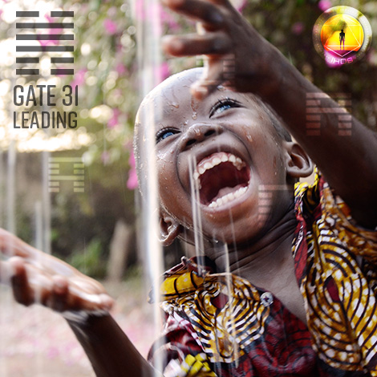
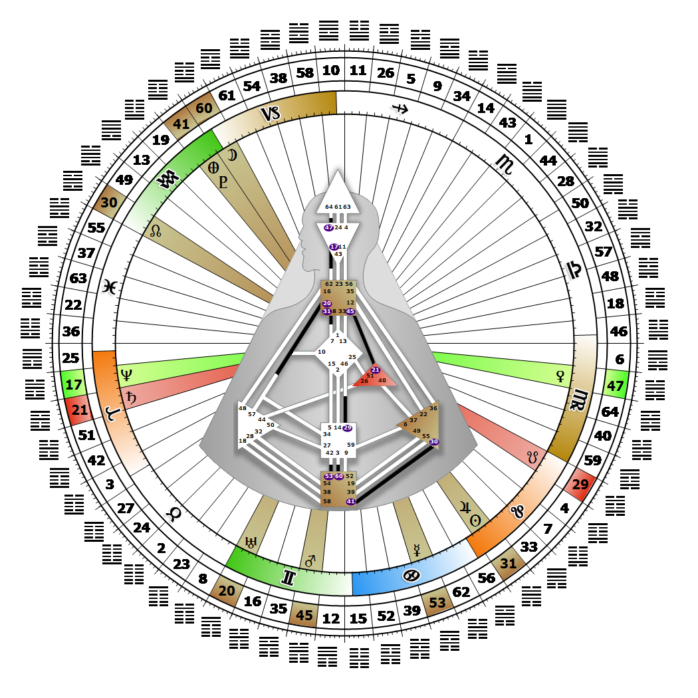

# Gate 31 - Influence

**July 29, 2026**

## *Gate of Influence - I Lead*

> The law of friction, whether active or passive, that engenders transference and thus influence. The natural expression of leadership.

### Left Angle Cross of the Alpha | Godhead - Maat

*Quarter of Civilization,  the Realm of DubheTheme: Purpose fulfilled through FormMystical Theme: Womb to Room*

---

This Gate is part of the Channel of The Alpha, For 'Good' or 'Bad' a Design of Leadership, linking the Throat Center (Gate 31) to the G Center (Gate 7). Gate 31 is part of the Collective Understanding (Logic) Circuit with the keynote of sharing.

Gate 31 is designed to be influential. Collective leadership is collegial, not hierarchical. It provides the vision for a new direction and shows others how to achieve it, rather than doing it for them. The 31st gate manifests its potential for verbal influence through election. When money is the energy used to move a person into a position of power, instead of the cooperative will of the people, the Collective's overall ability to ensure humanity's future is easily perverted. Our voice through the 31st gate, "I lead," is not heard until backed by the energy of the majority. The people are the ones who must act on what our voice says.

The influence of our vision for society will not be transferred or felt without the Collective's energy moving it into the public realm. Our leadership must take into account the desires of our followers, and address the good of the whole. 'I lead' means influencing others, for good or for ill, by effectively transferring our vision for a new and test-worthy pattern to them to carry out. Without the presence of Gate 7, we may seem like just an empty voice.

---

### Line 5 - Self-righteousness

**☀️ Exaltation:** A natural specialization that only develops in isolation. However, when the development is complete, the extremely difficult and generally impossible task of externalizing the influence. A specialization that demands that one leads oneself.

**🌑 Detriment:** A deep focus on personal experience that is self-fulfilling and has no external ambitions. A lack of ambition where one is content to lead oneself.
