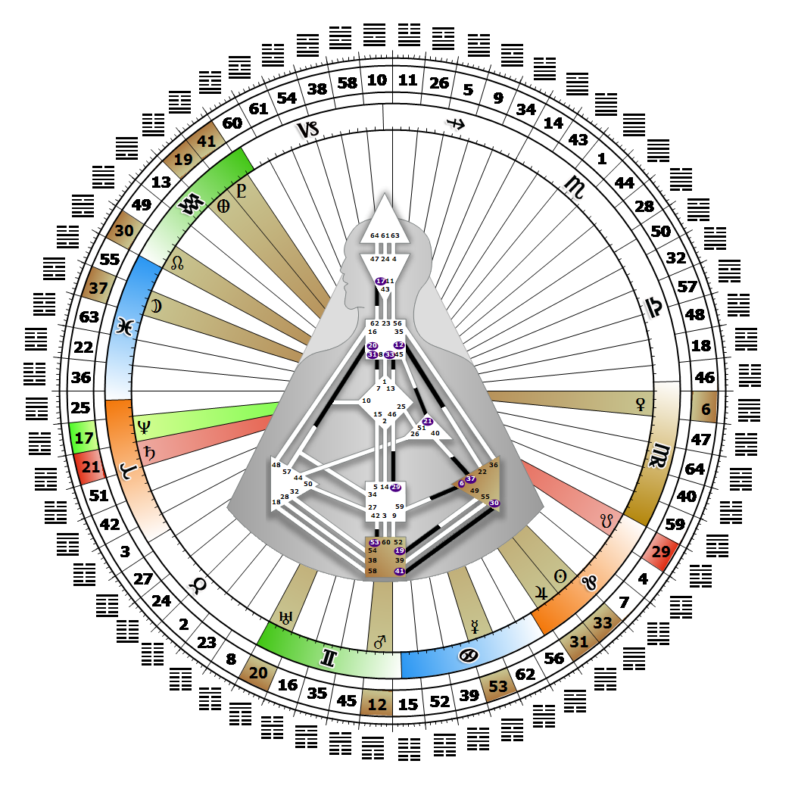

# Gate 33 - Retreat

**August 01, 2026**

## *Gate of Privacy - The Revelation of Secrets*

> Active withdrawal and the transformation of a weak position into a strength. Wisdom and experience is shared through the voice of remembrance.

### Right Angle Cross of the Four Ways 2 | Godhead - Maat

*Quarter of Civilization,  the Realm of DubheTheme: Purpose fulfilled through FormMystical Theme: Womb to Room*

---

This Gate is part of the Channel of The Prodigal, A Design of the Witness, linking the Throat Center (Gate 33) to the G Center (Gate 13). Gate 33 is part of the Collective Sensing (Abstract) Circuit with the keynote of sharing.

Gate 33 marks the end of a cycle, and built into all endings is a moment of silence for considering every aspect of the experience. This is where our need to be alone comes from. Retreat for us arises in that moment of uncertainty between the completed experience and a new one, a pause that allows us to reflect on what to take forward while we renew our strength. It is in the quiet moments of contemplation that the most valuable lessons, stored in the depths of Collective memory (Gate 13), will come to the surface.

In Gate 33 our need for privacy is joined by the Collective's voice of "I remember." It is also our nature to share the lessons of experience and reveal its truths. The experience can be one of our own, or another's, or even that of a group of people; the process is the same. When the time is ripe, we will be asked to share our wisdom, which then becomes part of the greater community and humanity's evolving consciousness. Like the Prodigal, we mature over our lifetime, and our realm of influence expands as we move through each cycle of experience. Without Gate 13 we may not have a sense of the right timing for sharing our lessons.

---

### Line 2 - Surrender

**☀️ Exaltation:** The recognition that surrender to superior forces can be an opportunity to expand one's own strengths and eventually triumph. Embracing powerful forces in order to lay the foundation for future success.

**🌑 Detriment:** Unlike the reasoned and calculated surrender above, the deeper and personal surrender. The feeling that one's original position was a delusion and the impressionability that makes might right. A public embrace of powerful forces, and a private resentment of their power.
