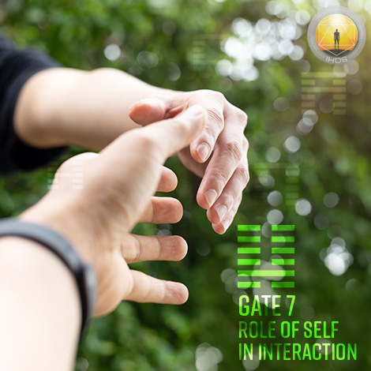
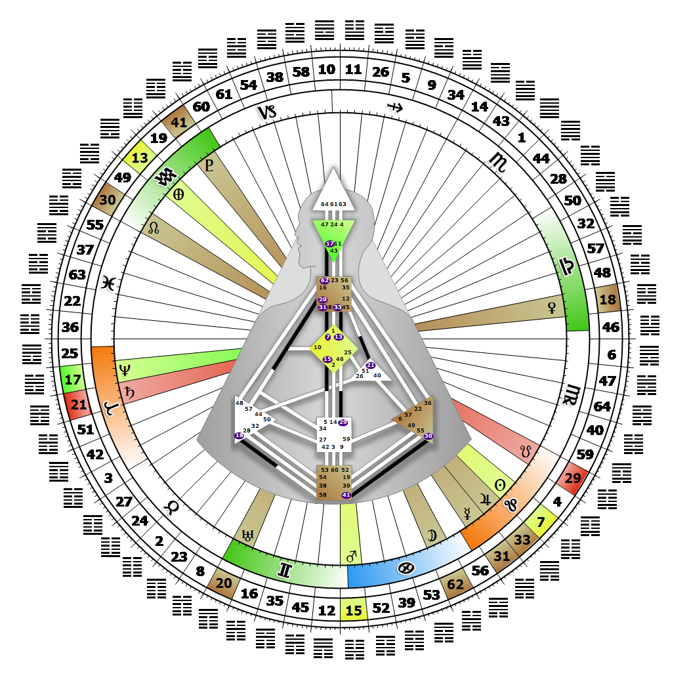

# Gate 7 - The Army

**August 11, 2026**

## *Role of the Self in Interaction - The Elected Leader*

> The point of convergence. By design, the need for leadership to guide and order society. Established proven patterns lead us into the future.

### Left Angle Cross of Masks 2 | Godhead - Thoth

*Quarter of Duality,  the Realm of JupiterTheme: Purpose fulfilled through BondingMystical Theme: Measure for Measure*

---

This Gate is part of the Channel of The Alpha, For 'Good' or 'Bad' the Design of Leadership, linking the G Center (Gate 7) to the Throat Center (Gate 31). Gate 7 is part of the Collective Understanding (Logic) Circuit with the keynote of sharing.

The 7th gate is oriented toward the future, with an ability to see when society's present direction needs correcting to get there. This is logic's gate of direction, part of the Right Angle Cross of the Sphinx. The substance of its contribution to the Collective is expressed through designated leadership roles, which are the: Authoritarian, Democrat, Anarchist, Abdicator, General, and Administrator. These roles are genetic and mechanical, and have tremendous conditioning power within the Collective. Through our role, and with our understanding of humanity's future direction, we persuade others to follow our leadership, thereby influencing people in positions of influence themselves, especially those with Gate 31.

Those who carry this gate may evaluate or modify the existing pattern or questionable direction, or be the catalyst for creating a new direction. This position of influence is described as the power behind the throne. In other words, without Gate 31 we can be a public leader but not necessarily the public figurehead who directly influences the Collective.

---

### Line 6 - The administrator

**☀️ Exaltation:** The power to communicate the frameworks of responsibility. The capacity of the Self through its role to communicate responsibility.

**🌑 Detriment:** The bureaucrat whose lust for power eventually destabilizes the organisation. The role of the Self to seek power through the communication of responsibility.
