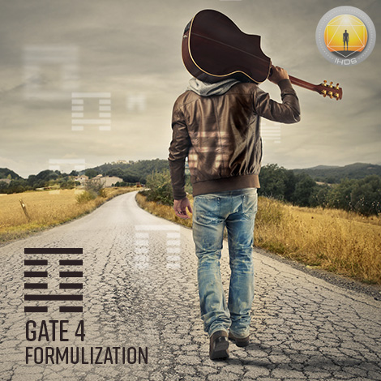
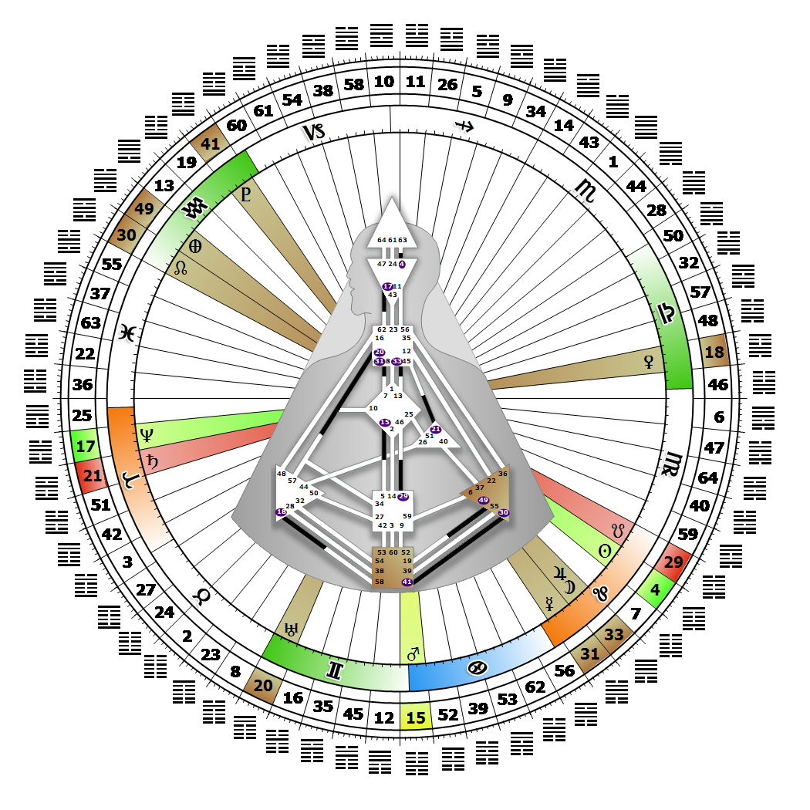

# Gate 4 - Youthful Folly

**August 12, 2026**

## *Gate of Formulization - Logic Protects us From Misfortune*

> The energy to beguile and succeed despite ignorance. Freedom from retribution. An answer, a formula, is only a potential.

### Right Angle Cross of Explanation 3 | Godhead - Thoth

*Quarter of Duality,  the Realm of JupiterTheme: Purpose fulfilled through BondingMystical Theme: Measure for Measure*

---

This Gate is part of the Channel of Logic, A Design of Mental Ease Mixed with Doubt, linking the Ajna Center (Gate 4) to the Head Center (Gate 63). Gate 4 is part of the Collective Understanding (Logic) Circuit with the keynote of sharing.

Gate 4 applies mental awareness to questions fueled by doubt about the future; it formulates logic's answers. Each answer, each formula, is only a potential, which must eventually be tested and substantiated by facts. That means that our answers may be the ones people seek, and they may not be. We use our mental intelligence and mental awareness to judge what looks suspicious. The pressure of a doubt or suspicion can last a lifetime, however, and we need to rely on our Authority to guide us to the correct question(s) on which to concentrate our energy while we wait for the right timing to share our answers. Ultimately, the answers we formulate are to be applied to questions that come from people around us. Rarely if ever can we formulate answers that provide solutions to our own questions about our life. Understanding and accepting this truth can bring the comfort of letting answers come and go in our mind, until the time is right for one to be brought to the surface by being asked to share it for the benefit of others.

If we do not have Gate 63, we may spend a lot of time looking for the next inspirational question we can answer in order to resolve the lack of logic and chaos of the mind.

---

### Line 1 - Pleasure

**☀️ Exaltation:** The instinct to know the right moment and circumstances where pleasure is rewarded and not punished. The potential to recognize that there is a natural timing to the understanding process.

**🌑 Detriment:** Timing is not a product of discipline. Exaggerated self-discipline leads to the abuse of pleasure. The potential to recognize but the urge to force the timing.
