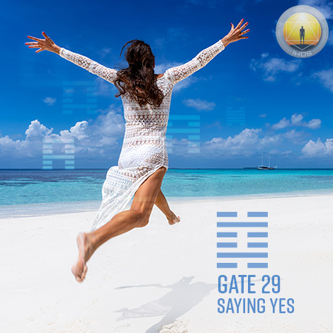
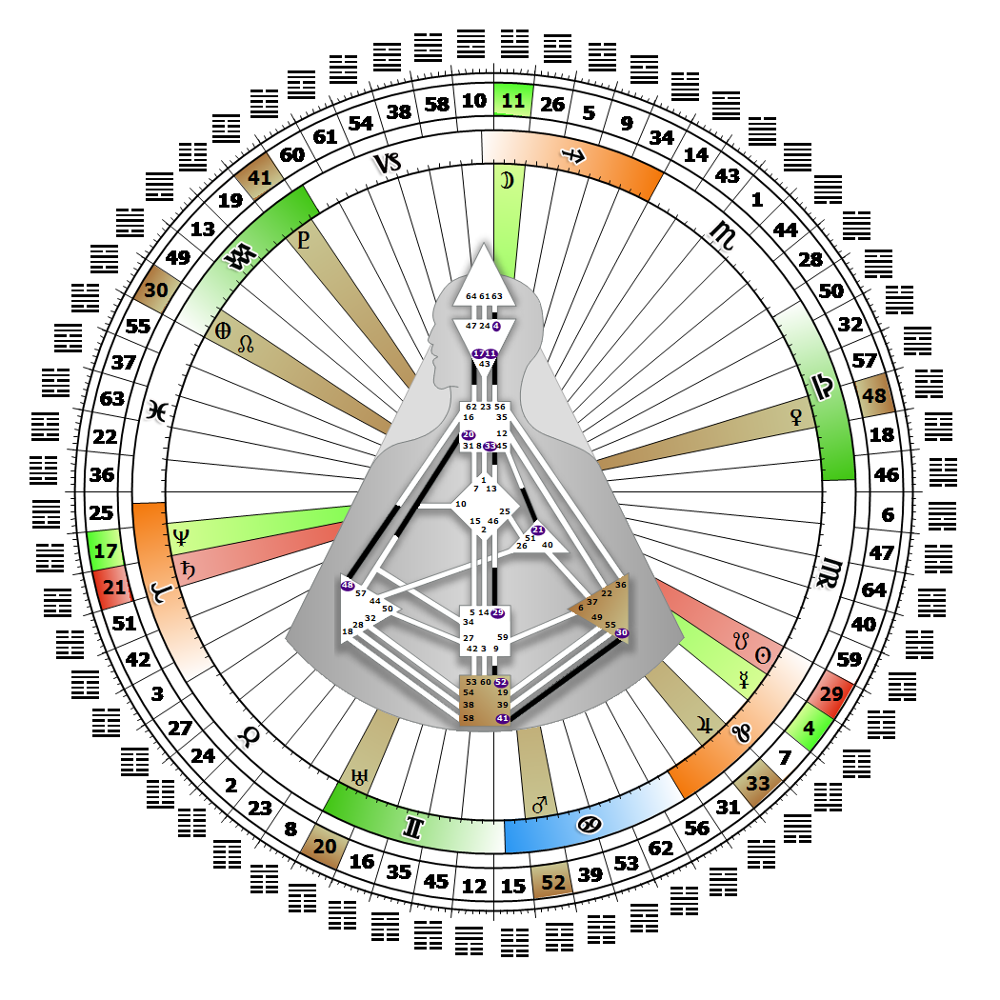

# [翻译失败] Gate 29 - The Abysmal

**2026年08月22日**

## *[翻译失败] Gate of Perseverance - Energy to Persevere Despite Circumstance*

> [翻译失败] The deep within the deep. Persistence despite difficulties has its inevitable rewards. Discovery does not lie in the commitment but in the process.

### [翻译失败] Left Angle Cross of Industry 2 | Godhead - Thoth

*[翻译失败] Quarter of Duality,  the Realm of JupiterTheme: Purpose fulfilled through BondingMystical Theme: Measure for Measure*

---

[翻译失败] This Gate is part of the Channel of Discovery, A Design of Succeeding Where Others Fail, linking the Sacral Center (Gate 29) with the G Center (Gate 46). Gate 29 is part of the Collective Sensing (Abstract) Circuit with the keynote of sharing.

Gate 29's potential is a constant affirmation of life. When it answers yes, it commits its energy to something or someone new, and will persevere through whatever the cycle of discovery brings. Perseverance is cyclical, however, and what we are committed to one day may no longer be of interest the next. Each correct commitment we make supports the maturation of our full potential for discovering who we are in relationship to others and the world. Those who carry this gate are always eager to say "yes," always ready to commit their energy, so it is best to wait until they are quite clear about what is truly right for them to invest their energy in.

Our Sacral response is mechanical, and we cannot know where the adventure will take us or what wonders we may find. Gate 29 has a single-minded energy designed to move us through even the most difficult and challenging circumstances, but only if it is fully aligned with our decision. Our only insurance is to let go of our expectations, and rely on our Strategy and Authority to guide us to the correct experiences. Without the 46th gate, we are ready to work but don't necessarily know what we are working towards.

---

### [翻译失败] Line 6 - Confusion

**☀️ 高階表達:** [翻译失败] Driving blind and given Mars' energy and determination, often blind luck. The power to persevere that makes no sense.

**🌑 低階表達:** [翻译失败] A tendency in confusion to withdraw rather than accept the condition and continue to persevere. The power in confusion to caution rather than saying yes.
