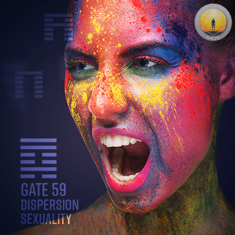
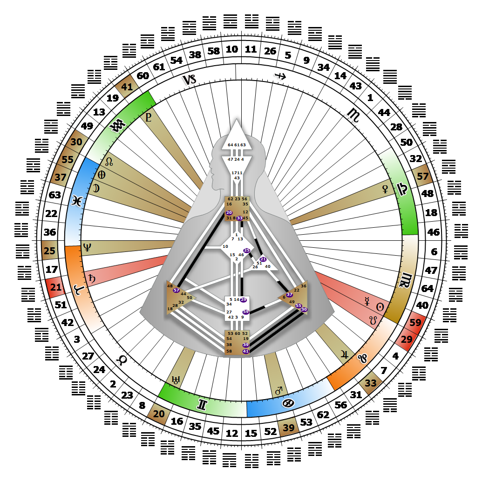

# [翻译失败] Gate 59 - Dispersion

**2026年08月28日**

## *[翻译失败] Gate of Sexuality - Bonding and Intimacy Beyond Words*

> [翻译失败] The ability to break down barriers to achieve union. The potential energy for a deep and fertile connection with the other resulting in a life creating union.

### [翻译失败] Left Angle Cross of Spirit 2 | Godhead - Thoth

*[翻译失败] Quarter of Duality,  the Realm of JupiterTheme: Purpose fulfilled through BondingMystical Theme: Measure for Measure*

---

[翻译失败] This Gate is part of the Channel of Mating, A Design Focused on Reproduction, linking the Sacral Center (Gate 59) with the Solar Plexus Center (Gate 6). Gate 59 is part of the Tribal (Defense) Circuit with the keynote of support.

Gate 59 generates our genetic strategies for sexual bonding and creating new life. Also known as the "aura breaker," it defines the ways we penetrate or break through barriers to intimacy in order to create offspring, or enter into a creative business venture with someone. Relationships and bonding is important to us and the 6 Lines of Gate 59 describe the ways humanity approaches bonding. They are genetic strategies, and each role is singularly focused on selecting the best partner for producing the most viable offspring.

The only real choice we have in this matter is to enter into each intimate relationship through our Strategy and Authority so that we are bonded with the correct mate. Tribal intimacy is warm and deeply felt; it's an intimacy beyond words intensified by our sensitivity to the other through touch, taste and smell. Unless we pay attention to our Authority, intimacy can bring anything from confusion and conflict to unproductive unions. We may find ourselves automatically looking to someone with Gate 6 to guide the timing of our interactions.

---

### [翻译失败] Line 6 - The one night stand

**☀️ 高階表達:** [翻译失败] The perfected relationship whether for a moment or an eternity. The power for intimacy regardless of conditions.

**🌑 低階表達:** [翻译失败] The basic drive to move on, that seeks impermanency as a matter of course and not in response to circumstances. The drive for sexual and intimate diversity.
