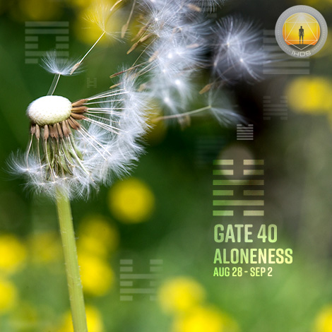
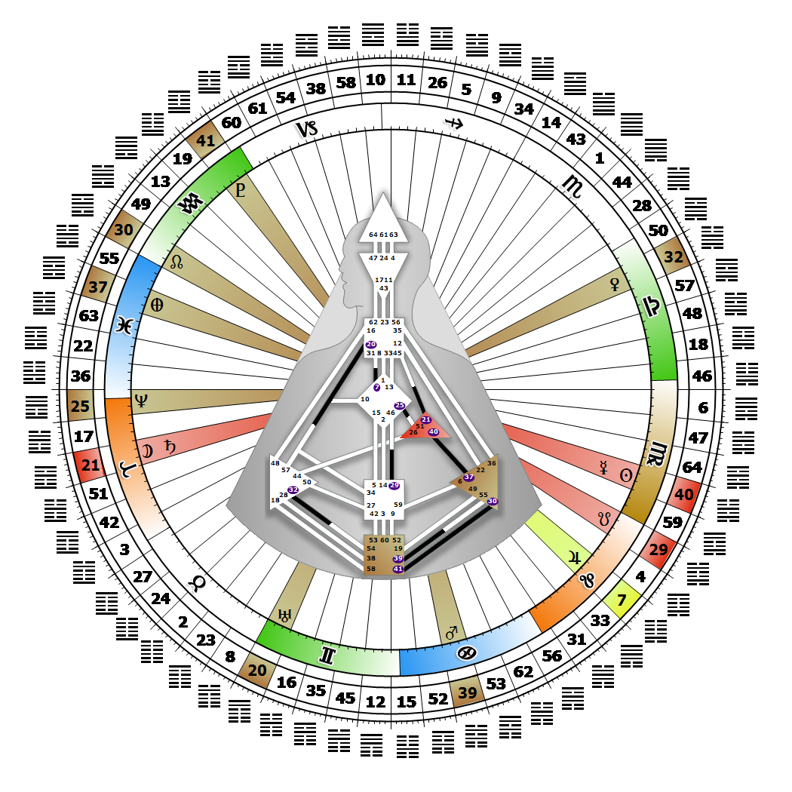

# Gate 40 - Deliverance

**August 31, 2026**

## *Gate of Aloneness - The Power of the Will to Deliver*

> The point of transition between struggle and liberation. The survival of the community is dependent upon a sustained and strong will.

### Right Angle Cross of Planning 3 | Godhead - Harmonia

*Quarter of Duality,  the Realm of JupiterTheme: Purpose fulfilled through BondingMystical Theme: Measure for Measure*

---

This Gate is part of the Channel of Community, A Design of a Part Seeking a Whole, linking the Ego Center (Gate 40) with the Solar Plexus Center (Gate 37). Gate 40 is part of the Tribal (Ego) Circuit with the keynote of support.

Gate 40 is one of three gates of aloneness (12 and 33 are the other two), and carries a sense of being alone even when in a group of people. This aloneness is the beginning of the individuation process; we need to separate ourselves from the Tribe. In essence, it is the desire within us for wholeness, expressed and experienced by others as strong independence, or as stepping away from their interdependence. This is an aspect of the ego's willpower that is essential to the survival of community.

Gate 40 is the love of work, and when we are involved in work that is correct for us, we derive great satisfaction from delivering what we promised to an appreciative Tribe. The relationship bargain needs to be renegotiated often and kept crystal clear. Yes, we are willing to work and to exert our ego's will power to provide for our family or community, but they get access to our earned resources only if they keep their side of the bargain. They need to show appreciation and loyalty for our efforts and support us emotionally, feed us, give us time alone to rest, and take care of us with the resources we provide for them. Without Gate 37, we may find ourselves looking for friendship, and a community to offer our ego's willing provisions to.

---

### Line 3 - Humility

**☀️ Exaltation:** The subtlety to enjoy deliverance without having to flaunt it. The capacity of the ego to avoid negative forces even if it means being alone.

**🌑 Detriment:** The ego arrogance that demands attention and gets it. The capacity of the ego to demand attention.
