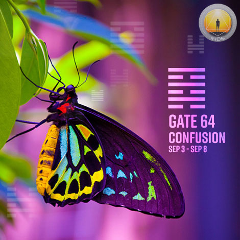
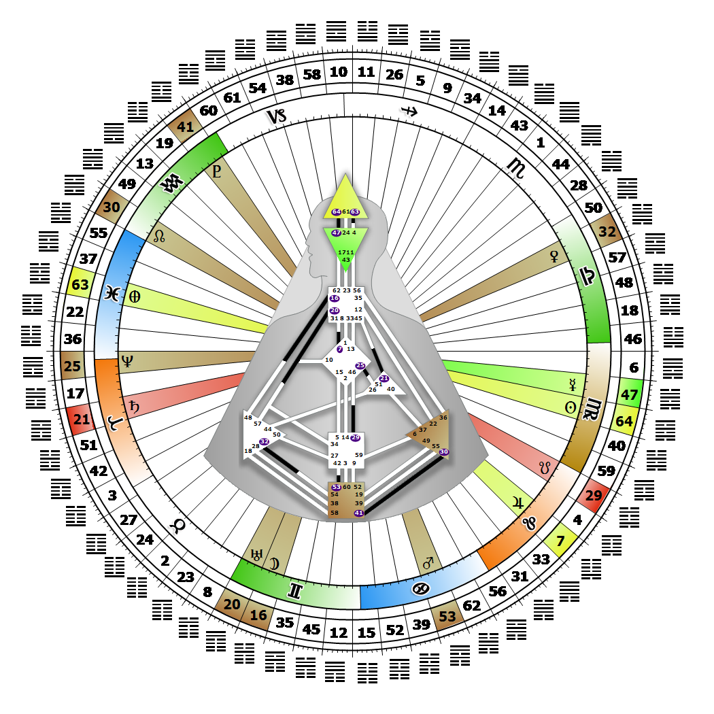

# Gate 64 - Before Completion

**September 04, 2026**

## *Gate of Confusion - Pressurized Mental Activity*

> Transition, like birth, requires a determined strength for the passage through. Making sense of the past through reflection.

### Right Angle Cross of Consciousness 3 | Godhead - Harmonia

*Quarter of Duality,  the Realm of JupiterTheme: Purpose fulfilled through BondingMystical Theme: Measure for Measure*

---

This Gate is part of the Channel of Abstraction, A Design of Mental Activity and Clarity, linking the Head Center (Gate 64) with the Ajna Center (Gate 47). Gate 64 is part of the Collective Sensing (Abstract) Circuit with the keynote of sharing.

Accepting confusion, the state before order is established, is part of Gate 64's process of attempting to make sense of a constant flow of data that continually recycles through the mind. Gate 64 is the pressure behind that flow, not the gate that resolves the confusion. Our mind is filled with a string of disconnected memories and images from our past that need filtering and sorting until we can see or make sense of what really happened. In order to enjoy our mental state of confusion and not become overwhelmed by it, let the clips of our past experiences simply stream through our mind until the message of the movie becomes clear to us. When it does, share it with others.

If we put pressure on our mind to figure the data out with a specific methodology, we may increase our level of confusion and trigger anxiety. It takes great inner strength to let the confusion process resolve in its own way and time, thus leaving our peace of mind intact. It may also be tempting to react in some way once the clarity arrives, but these "aha's" are for sharing, not acting upon. Without Gate 47 we may be tempted to resolve the confusion prematurely.

---

### Line 1 - Conditions

**☀️ Exaltation:** In penetrating to the center, the understanding that instills the necessary harmony to survive disorder. Amongst the confusion, the difficulty in finding the point.

**🌑 Detriment:** The powerful temptation when having transition in sight, to hasty action. An urge to act when you think you have made sense of the confusion.
