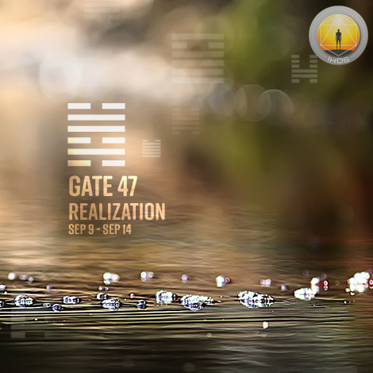
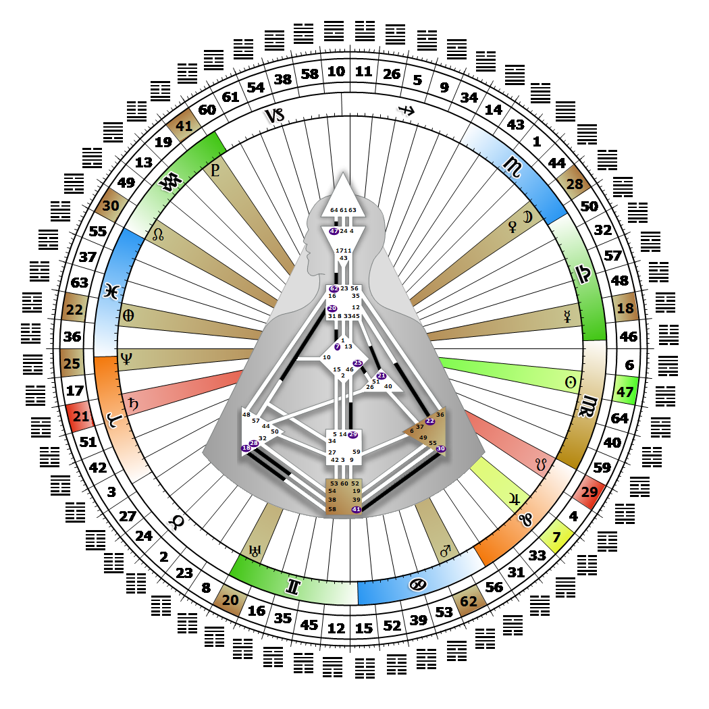

# Gate 47 - Oppression

**September 14, 2026**

## *Gate of Realization  - Wait for the Moment of Realization*

> A restrictive and adverse state as a result of internal weakness or external strength or both. You can not go into the image pool hoping to find a resolution.

### Left Angle Cross of Informing 2 | Godhead - Harmonia

*Quarter of Duality,  the Realm of JupiterTheme: Purpose fulfilled through BondingMystical Theme: Measure for Measure*

---

This Gate is part of the Channel of Abstraction, A Design of Mental Activity and Clarity, linking the Ajna Center (Gate 47) with the Head Center (Gate 64). Gate 47 is part of the Collective Sensing (Abstract) Circuit with the keynote of sharing.

If Gate 64 is the one who remembers the disorganized collection of film clips that passes through its life, then Gate 47 is the editor who attempts to assemble them all into a meaningful slice of human experience. We will not see the full picture immediately as we tentatively start to sort through the collection of images, and it may not be apparent at first which clip holds the key to our eventual mental realization. As new details emerge, we may vacillate between perceiving the event this way or that way through a mix of recognitions that direct us toward different interpretations.

At first we may feel that rather than the process becoming easier, it is becoming more complicated for us to reassemble the mental sequences in a way that makes sense. If we can step back and trust, however, we will eventually cycle through to that "aha" moment. The secret is to avoid the pressure to act on every conclusion that comes to us, and simply enjoy the array of possibilities that move through our active mind, until one stands out. We are then ready, when asked and it is correct for us, to share our recognitions with others. Without Gate 64 we may put pressure on ourselves, and forget to wait for the revelation that will truly bring the mental activity to a temporary halt.

---

### Line 6 - Futility

**🌑 Detriment:** The Sun in detriment, where the strength of will alone may find a way to adapt and survive, but without hope of ever overcoming the oppression. Life as an ordeal stripped of realization.
