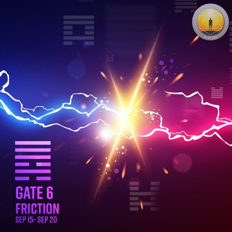
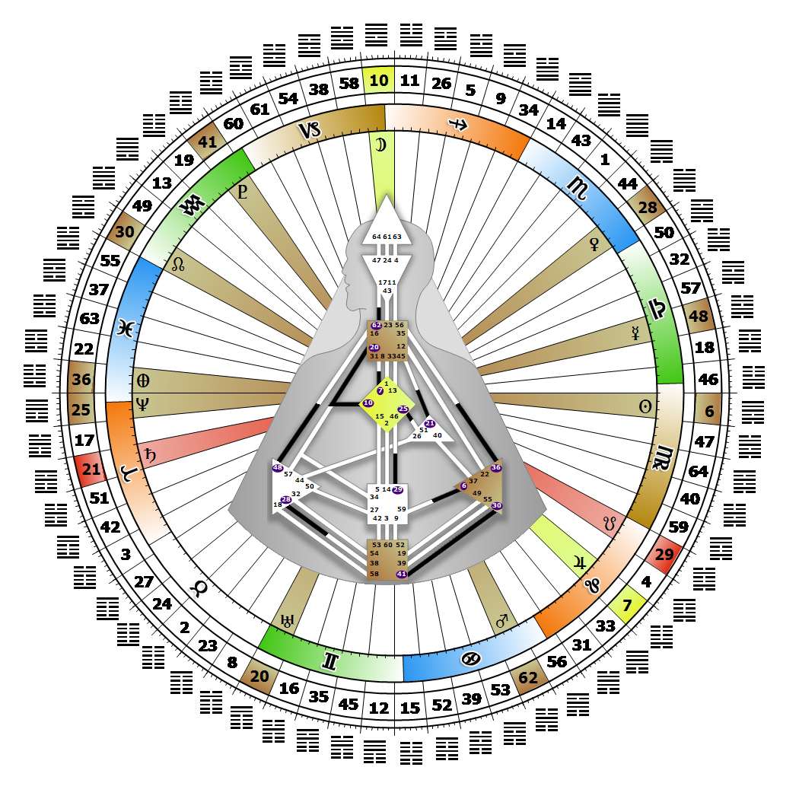

# [翻译失败] Gate 6 - Conflict

**2026年09月19日**

## *[翻译失败] Gate of Friction - Feeling, Emoting, and Sensitivity*

> [翻译失败] The fundamental design component of progress. The law that growth cannot exist without friction. The energy for producing life itself.

### [翻译失败] Right Angle Cross of Eden 3, Juxtaposition Cross of Conflict | Godhead - Harmonia

*[翻译失败] Quarter of Duality,  the Realm of JupiterTheme: Purpose fulfilled through BondingMystical Theme: Measure for Measure*

---

[翻译失败] This Gate is part of the Channel of Mating, A Design Focused on Reproduction, linking the Solar Plexus Center (Gate 6) to the Sacral Center (Gate 59). Gate 6 is part of the Tribal (Defense) Circuit with the keynote of support.

Gate 6 in the Solar Plexus Center generates all three modes of emotional awareness: feelings, moods and sensitivity. This is a powerful motorized combination on a wave that is designed to create friction. This friction produces the heat essential for growth and fertility, and is aimed at Gate 59. The friction created by those with this gate when they step into another person's aura is a mechanic. If (or when) the conflict is resolved, or resonance is reached, there is then an opening and intimacy can proceed. Until there is such an opening, we must wait, as readiness and fertility are both subject to the emotional wave.

Gate 6 is a kind of diaphragm that either opens up to intimacy or closes. It is the gate of our pH, and establishes and maintains the boundary between what is outside and what is inside our body. In this way it determines who to be intimate with, when, and the bonding role we will play. Each time we feel drawn toward intimacy, let Strategy and Authority be our guide. Each gate in the Solar Plexus carries a fear. The fear associated with the 6th gate is the fear of intimacy, which is why Gate 6 looks to Gate 59 with its ability to break down the barriers to intimacy.

---

### [翻译失败] Line 4 - Triumph

**☀️ 高階表達:** [翻译失败] The charity and wisdom that must come with victory and the movement towards new horizons.. The power of emotions to dominate a relationship.

**🌑 低階表達:** [翻译失败] The conqueror and purger. The lack of emotional control that is destructive in relationships.
