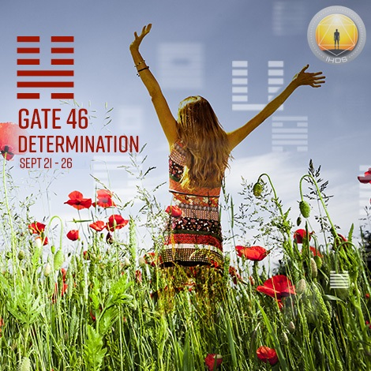
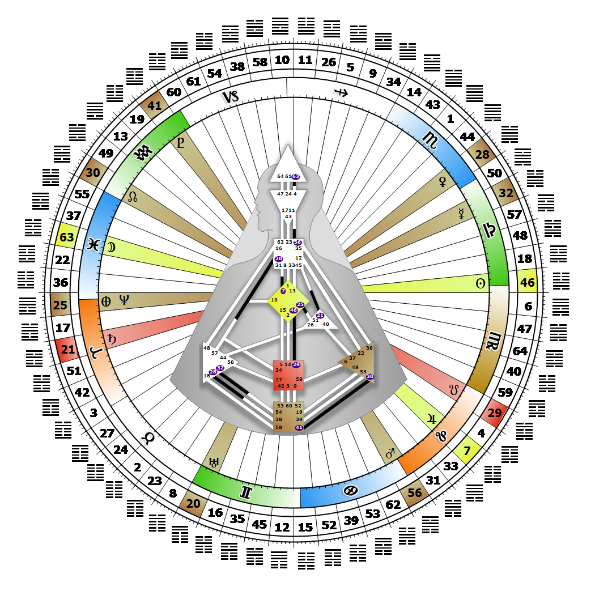

# [翻译失败] Gate 46 - Pushing Upward

**2026年09月25日**

## *[翻译失败] The Gate of the Determination of the Self - The Body is the Temple*

> [翻译失败] Good fortune that may be perceived as the result of serendipity but derives from effort and dedication. To accept that one is in the right place is deeply spiritual.

### [翻译失败] Left Angle Cross of Healing 2 | Godhead - Christ

*[翻译失败] Quarter of Duality,  the Realm of JupiterTheme: Purpose fulfilled through BondingMystical Theme: Measure for Measure*

---

[翻译失败] This Gate is part of the Channel of Discovery, A Design of Succeeding Where Others Fail, linking the G Center (Gate 46) with the Sacral Center (Gate 29). Gate 46 is part of the Collective Sensing (Abstract) Circuit with the keynote of sharing.

The 46th gate is focused on the quality of life we experience in a physical body. It expresses the love of the body, and the sensual honoring of it as a temple in which we are always in the right place at the right time. We are one who lives the good fortune and discovery of serendipity. Whether we succeed or fail is dependent on the determination of our higher selves. This is an abstract process of surrender to a cycle of experience that can fulfill our potential or bring chaos.

The lessons we learn and the wisdom we share with others is derived from our determination, dedication and absorption in the experience as we are living it. The experience of the nature of ourselves in interaction with others is a deeply spiritual process, and can only be evaluated when the cycle is complete. If we cannot commit ourselves to the cyclical nature of life, our body will begin to fail under the stress of constant crisis. Without the 29th gate, we may recognize the right timing, but not have the energy to begin the process or the perseverance to complete it.

---

### [翻译失败] Line 5 - Pacing

**☀️ 高階表達:** [翻译失败] The maintenance of proper rhythm that in its instinctive practicality avoids radical divergence from successful patterns. The determination to stay with the rhythm which brings success.

**🌑 低階表達:** [翻译失败] An irrational rejection of the very patterns that have proven successful. Determined to say no to the very rhythm that brings success.
