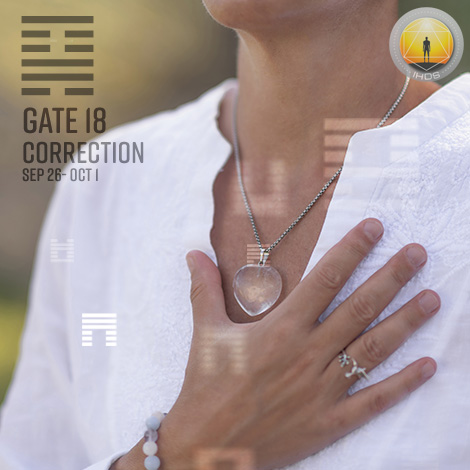
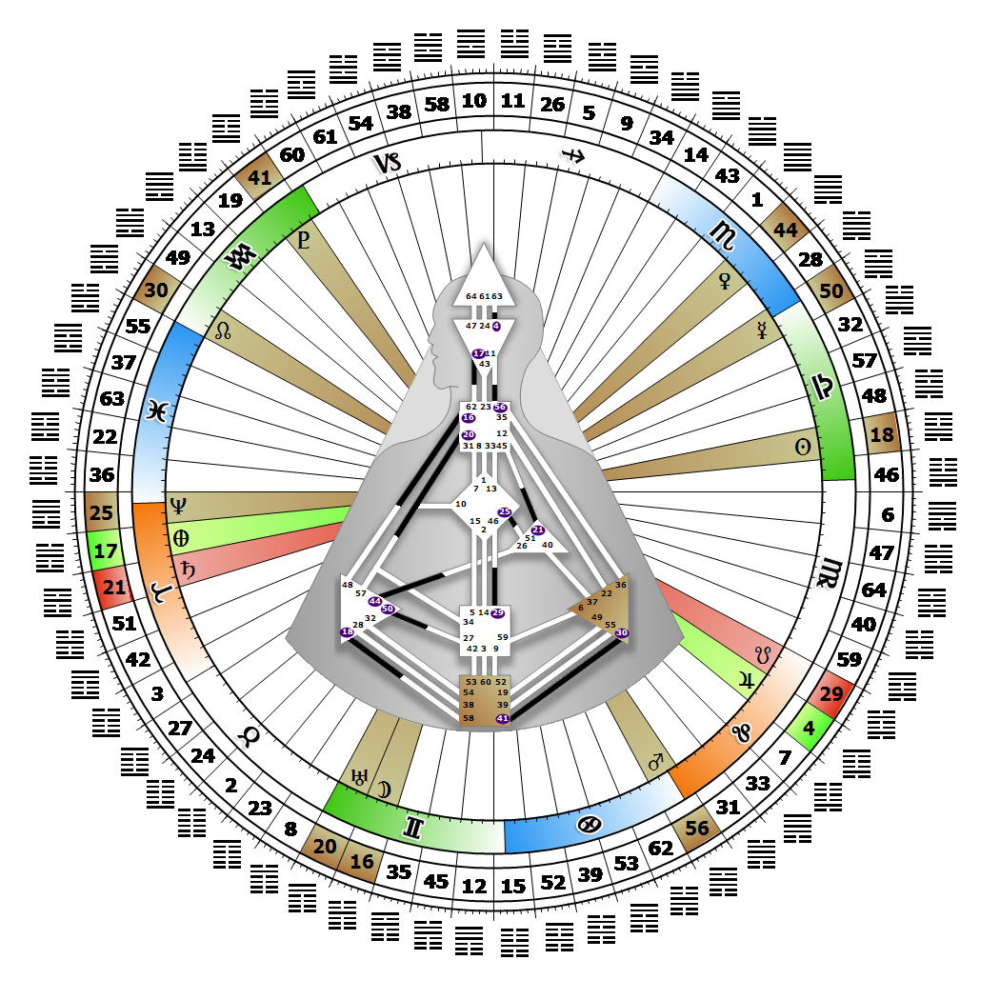

# [翻译失败] Gate 18 - Work on what has been spoilt

**2026年10月01日**

## *[翻译失败] Gate of Correction - Essential Learning*

> [翻译失败] The vigilance and determination to uphold and defend basic and fundamental human rights. Dissatisfaction fuels the life-long process of correcting and improving.

### [翻译失败] Left Angle Cross of Upheaval 2 | Godhead - Christ

*[翻译失败] Quarter of Duality,  the Realm of JupiterTheme: Purpose fulfilled through BondingMystical Theme: Measure for Measure*

---

[翻译失败] This Gate is part of the Channel of Judgment, A Design of Insatiability, linking the Splenic Center (Gate 18) to the Root Center (Gate 58). Gate 18 is part of the Collective Understanding (Logic) Circuit with the keynote of sharing.

Gate 18 enjoys discovering, naming and challenging what needs correcting. When we experience dissatisfaction with something, chances are it has lost its vitality. Underneath this dissatisfaction lies a deep concern for human rights, and for what will keep society healthy and in harmony with itself. Those who carry this gate have a gift of critical awareness that directs them to the source of a weakness or imperfection, and focuses their thinking on ways to correct or modify or replace it. It is our way of cleaning out what isn't healthy, or restoring vitality to something that has been corrupted. Our gift is enhanced by impartial discernment, and logic's drive to perfect or fine tune our own skills of critical analysis.

Ushering in a new understanding through identifying what needs correcting is the by-product of the process. Gate 18 also represents the fear of authority and the challenge to that authority. As a Collective gate, it is designed to point out what needs to be corrected at the Collective level, but when used at the personal level it tends to backfire. Without Gate 58's joyful fuel for correction, our dissatisfaction can become merely a constant source of fault finding. This is especially true if our valuable and crucial awareness is no longer productively focused on situations, patterns or institutions, but rather on people's idiosyncrasies and foibles.

---

### [翻译失败] Line 5 - Therapy

**☀️ 高階表達:** [翻译失败] The wisdom to both seek and provide guidance. The potential for correction and judgment through relationships.

**🌑 低階表達:** [翻译失败] The mental patient. Chronic instability and potential madness. Where relationships cannot assist in correction the potential of mental instability.
