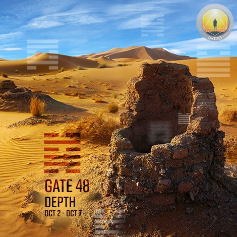
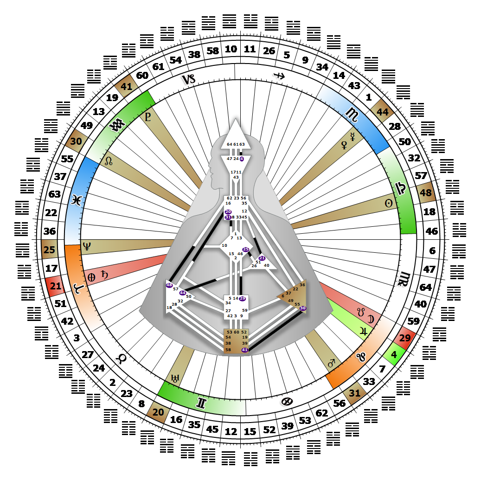

# [翻译失败] Gate 48 - The Well

**2026年10月06日**

## *[翻译失败] Gate of Depth - A Resource Available in the Now*

> [翻译失败] The necessary and qualitative foundation that is a prerequisite to establish the common good. A storehouse of vital information as a pattern.

### [翻译失败] Left Angle Cross of Endeavor 2 | Godhead - Christ

*[翻译失败] Quarter of Duality,  the Realm of JupiterTheme: Purpose fulfilled through BondingMystical Theme: Measure for Measure*

---

[翻译失败] This Gate is part of the Channel of The Wave Length, A Design of Talent, linking the Splenic Center (Gate 48) to the Throat Center (Gate 16). Gate 48 is part of the Collective Understanding (Logic) Circuit with the keynote of sharing.

Gate 48 provides a potent awareness rooted in deep instinctual memory that gives us the potential depth to bring logic's real and workable solutions to the problems of society. More than anything, we want to express and share our depth in order to help others recognize, correct and perfect the world we live in. Without Gate 16 we may experience feelings of inadequacy, fearing that we won't be able to explain our solution, or periods of frustration when we realize that we must wait for our depth to be recognized by others before we can share it.

We may become overly concerned about developing skills we feel we lack. Relaxing into an active (expectant) waiting will usually draw people to us who will initiate our depth. In this way our potential solutions can emerge naturally and clearly as a foundation for evaluating, perfecting and mentoring the skills of others.

---

### [翻译失败] Line 5 - Action

**☀️ 高階表達:** [翻译失败] The natural urge to apply energy to action. A taste for action.

**🌑 低階表達:** [翻译失败] An overreliance on the need for protection that in times of social renewal is obsessed with the details of planning at the expense of action. Insecurity with one's depth that can fail to take action.
