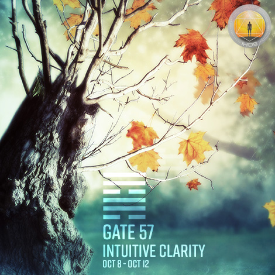
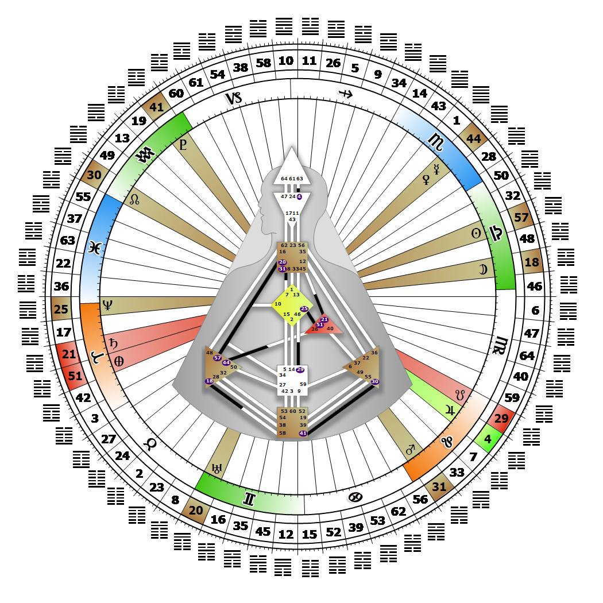

# Gate 57 - The Gentle

**October 09, 2026**

## *Gate of Intuitive Insight - Penetrate to the Core in the Now*

> The extraordinary power of clarity. Like a chill breeze that can touch you to the bone. The maximization of intuitive clarity demands existential attention.

### Right Angle Cross of Penetration 3 | Godhead - Christ

*Quarter of Duality,  the Realm of JupiterTheme: Purpose fulfilled through BondingMystical Theme: Measure for Measure*

---

This Gate is part of the Channel of The Brain Wave, A Design of Awareness, linking the Splenic Center (Gate 57) with the Throat Center (Gate 20). Gate 57 is part of the Individual (Knowing) Circuit with the keynote of empowerment. This Gate is part of the Channel of Power, A Design of an Archetype, linking the Splenic Center (Gate 57) with the Sacral Center (Gate 34). Gate 57 is part of the Integration Channel with the keynote of self-empowerment. This Gate is part of the Channel of Perfected Form, A Design of Survival, linking the Splenic Center (Gate 57) with the G Center (Gate 10). Gate 57 is part of the Integration Channel with the keynote of self-empowerment.

With its clarity of intuitive insight, Gate 57 has the capacity to penetrate to one's core in the now. We have a deep inner attunement to sound that is constantly alert to the vibrations coming from our physical, emotional and psychic environments. Moment by moment our intuition registers a sense of what is safe, healthy and good for us, and what is not. Gate 57 is the gate of the right ear. If we want to hear what someone is really saying to us, listen with our intuitively attuned right ear. We must be alert and focused in the now to hear the messages from our intuition, or the information we are getting for survival may be ignored. We may sometimes appear deaf to others, or be accused of selectively hearing what they have to say, but our intuition is our only guide in determining what the perfect behavior is that will ensure our well-being. The only way we will alleviate our fears for the future is to pay close attention to our instinctual hunches, to that little voice that only speaks once and softly, and act on these hunches immediately.

---

### Line 2 - Cleansing

**☀️ Exaltation:** Perfected cleansing through inner realization. The possibility for proper values and ideals through intuition.

**🌑 Detriment:** A superficial cleansing that tends to hide the dirt underneath the carpet. The possibility that the depth of the intuition will be treated superficially.
